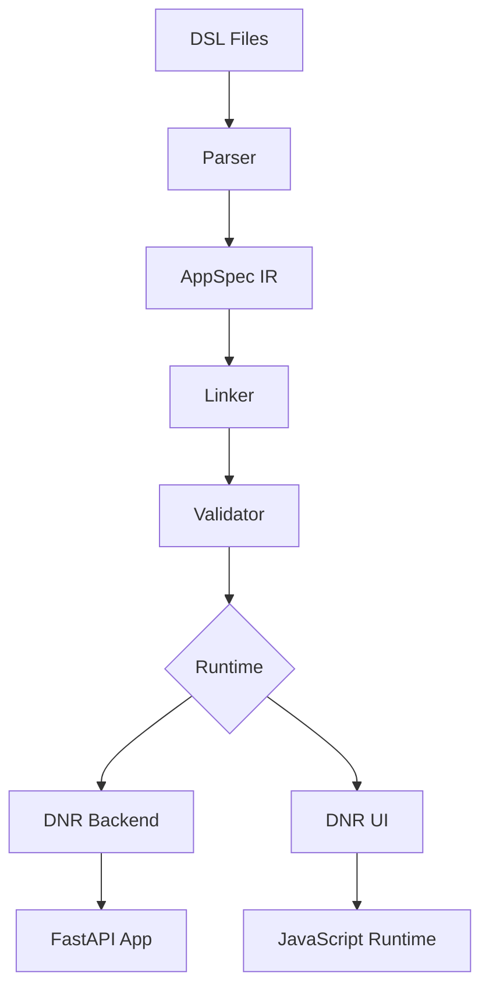

# DSL to AppSpec Pipeline

How Dazzle transforms DSL files into running applications.

## Pipeline Overview



## Stage 1: Parsing

The parser reads `.dsl` files and produces an abstract syntax tree (AST).

```python
from dazzle.core.dsl_parser import parse_dsl

ast = parse_dsl("""
entity Task "Task":
  id: uuid pk
  title: str(200) required
""")
```

Key features:

- Line-by-line parsing with column tracking
- Meaningful error messages with location
- Support for multi-file projects

## Stage 2: IR Generation

The AST is transformed into the Intermediate Representation (IR), called AppSpec.

```python
from dazzle.core.ir import AppSpec, EntitySpec

appspec = AppSpec(
    name="my_app",
    entities=[EntitySpec(...)],
    surfaces=[...],
    workspaces=[...]
)
```

The IR is:

- **Language-agnostic** - can be serialized to JSON
- **Normalized** - defaults filled in, references resolved
- **Validated** - semantic checks applied

## Stage 3: Linking

Multi-module projects are linked together:

```python
from dazzle.core.linker import link_modules

linked = link_modules([module1, module2, module3])
```

The linker:

- Resolves cross-module references
- Checks for circular dependencies
- Merges shared definitions

## Stage 4: Validation

Semantic validation ensures the spec is sound:

```python
from dazzle.core.validator import validate_appspec

errors = validate_appspec(appspec)
```

Validation checks:

- Entity field type compatibility
- Surface-entity bindings
- Workspace layout constraints
- Access rule consistency

## Stage 5: Runtime Generation

The validated AppSpec feeds into runtime generators:

### Backend (DNR-Back)

```python
from dazzle_dnr_back.converters import convert_appspec_to_backend

backend_spec = convert_appspec_to_backend(appspec)
```

Produces:

- Pydantic models from EntitySpec
- Services from ServiceSpec
- FastAPI routes from EndpointSpec

### Frontend (DNR-UI)

```python
from dazzle_dnr_ui.converters import convert_appspec_to_ui

ui_spec = convert_appspec_to_ui(appspec)
```

Produces:

- Workspaces with layouts
- Components from surfaces
- Reactive state bindings

## Data Flow

| Stage | Input | Output |
|-------|-------|--------|
| Parse | `.dsl` files | AST |
| IR | AST | AppSpec |
| Link | AppSpec[] | Linked AppSpec |
| Validate | AppSpec | Validated AppSpec |
| Backend | AppSpec | BackendSpec → FastAPI |
| UI | AppSpec | UISpec → JavaScript |

## Error Handling

Errors at each stage include:

- **Line/column** for parse errors
- **Entity/field** path for validation errors
- **Cross-reference** info for linking errors

```
Error at line 15, column 3:
  Entity 'Task' references unknown entity 'User' in field 'assigned_to'
```

## See Also

- [Architecture Overview](overview.md)
- [CLI Reference](../reference/cli.md)
