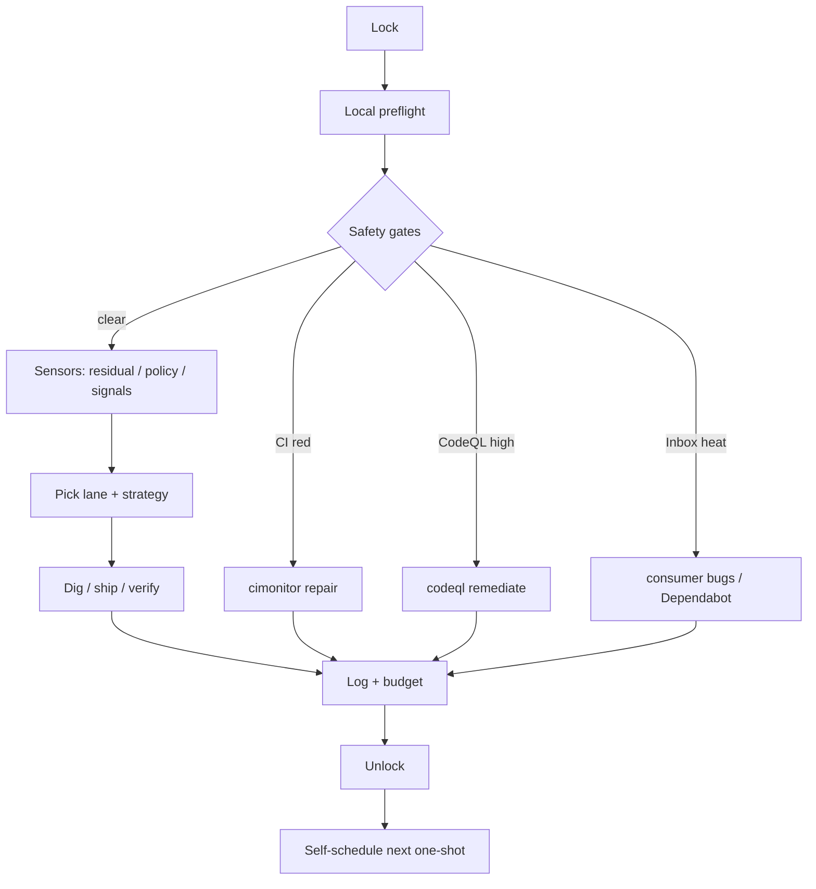
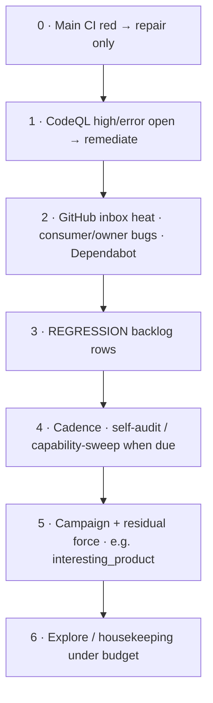

# Improve as a modern harness exemplar

**Audience:** humans who want to understand or adapt Dazzle’s autonomous
`/improve` loop.
**Not for:** the executing agent mid-cycle — that agent loads
`.claude/commands/improve.md` and the lane/strategy playbooks.

**Scope:** this document explains *structure and portable design*. It does not
change loop behaviour. Operational truth lives in the runtime runbook and
machine probes.

---

## 1. What problem this solves

Unattended software work usually fails in one of three ways:

1. **Silent thrash** — the agent rewrites the same surface without proof.
2. **Safety blindness** — feature work continues while main is red or a high
   severity alert is open.
3. **Session death** — the chain stops when the chat ends, with no re-arm.

`/improve` is a **convergent control plane**: one cycle, one owner, measurable
pick, bounded prove, durable log, then self-schedule the next fire. Ambition
(product digs) is always subordinate to **safety gates** and **machine residual**.

Dazzle-specific content (example apps, UX probes, Goal B depth menus) is the
*payload*. The *harness* is the control plane around that payload — and that
is what this page packages as an exemplar.

---

## 2. One cycle in ninety seconds



| Step | Portable idea | Dazzle instance |
|------|---------------|-----------------|
| Lock | Single writer | `.dazzle/improve.lock` (15m TTL) |
| Preflight | Cheap local red-stop | `make preflight-surface`, `make test-ux-preflight` |
| Safety gates | Fleet health before ambition | Main CI badge, CodeQL, GitHub inbox |
| Sensors | One residual number + policy | `improve_example_probes.py --status`, `improve_policy.py --status` |
| Pick | Highest leverage under policy | Lanes + strategies; campaign may force |
| Dig | One closed claim per cycle | Product / framework / repair playbook |
| Prove | Evidence artifact | Tests, still OCR, dig receipt |
| Log | Human-readable journal | `dev_docs/improve-log.md` |
| Budget | Cap thrash | Explore counter (cap 100) |
| Arm | Survive session death | `improve_schedule_next.py` → one-shot + daily watchdog |

**Termination is not “run forever.”** A cycle either advances a claim, repairs
a gate, seeds actionable work, or logs a specific hold reason (e.g. tip CI
in progress). The next fire is scheduled with an interval that matches heat
and CI state — not a fixed thrash ticker.

---

## 3. Portable anatomy

```text
┌──────────────────────────────────────────────────────────────┐
│  CONTROL PLANE  (single driver, one cycle)                     │
│  lock → preflight → gates → pick → dig → prove → log → arm     │
└───────────────┬──────────────────────────────┬─────────────────┘
                │                              │
     ┌──────────▼──────────┐        ┌──────────▼──────────┐
     │  SENSORS            │        │  ACTUATORS          │
     │  residual bars      │        │  product digs       │
     │  CI / CodeQL / inbox│        │  CI / security fix  │
     │  capability map     │        │  framework ships    │
     │  self-audit window  │        │  merge Dependabot   │
     └──────────┬──────────┘        └──────────▲──────────┘
                │                              │
                └──────────── POLICY ──────────┘
                     preemption order
                     residual → force
                     require_mutation
                     dig contracts
                     explore budget
```

### Five ideas that travel to other tasks

1. **Single driver, many playbooks** — plugins for work; one owner for the cycle.
2. **Safety before ambition** — red prod/CI outranks “interesting” work.
3. **Machine residual + human doctrine** — numbers pick; stills/receipts prove.
4. **Self-chaining one-shots** — CI-aware delay; dead-man’s switch if the chain dies.
5. **Verification culture** — periodic self-audit and inventory, not only feature digs.

---

## 4. Preemption stack

Higher rows win for **this** cycle. Product digs only run when higher rows are clear
(or unavailable and cannot be repaired here).



**Why this matters:** without preemption, a green residual bar becomes a license
to ignore a broken main badge. The exemplar behaviour is the opposite —
fleet-visible broken outranks local ambition.

---

## 5. Sensors vs actuators

| Sensor (question) | Dazzle tool | Typical actuator |
|-------------------|-------------|------------------|
| Is main shippable? | `gh` CI badge on `main` | `cimonitor` repair |
| High-severity code scanning? | CodeQL open alerts | `codeql` remediate |
| External bugs / green Dependabot? | `improve_github_inbox.py` | `consumer_issues` / `github_prs` |
| Product residual remaining? | `improve_example_probes.py --status` | maturity / demo / journey / presentation digs |
| What should aggressive mode force? | `improve_policy.py --status` | campaign force (e.g. Goal B depth) |
| Are we covering our own tools? | capability-map + sweep | stamp USED/STALE; recommend digs |
| Did recent ships invent drift? | self-audit on tipward commits | REGRESSION / AUD rows |
| Can we claim dig success? | dig receipt + stills | accept ship or fail closed |

Actuators are **lane strategies** (markdown playbooks) and a few **workflows**
for parallel cognition (`improve-self-audit`, `improve-capability-sweep`,
`improve-visual-review`). The driver still owns lock, gates, pick, ship, and
schedule after a workflow returns.

See the [strategy catalog](strategy-catalog.md) for a one-line purpose per playbook.

---

## 6. Policy: residual, force, and mutation

When probes report **work remaining** (`residual_total > 0`), policy usually
forces the strategy that clears the highest-leverage residual (presentation,
story walk, demo fleet, etc.).

When residual is **clear**, a naïve loop idles or re-stamps harness metrics.
Dazzle’s aggressive posture instead asks: **did we ship something a buyer
would notice?** That is Goal B / `interesting_product` doctrine — depth menus
(conversation, document, media, org structure, …) with **still proof**, not
dual-open attribute thrash alone.

| Concept | Meaning |
|---------|---------|
| **Goal A / harness_only** | Infrastructure or discovery work; do not claim product bake-off lift |
| **Goal B / interesting_product** | Closed depth id + hero recapture; buyer-visible surface |
| **require_mutation** | Prefer a real ship or an actionable PENDING seed over residual-clear thrash |
| **Leftover-token cadence** | Cap leftover-honest param walks (2 consecutive / 3 since last self-audit) so honesty is not scored as pin-file count |
| **densify_allowed** | Whether warehouse/index densify is in budget this cycle |
| **open_hop_streak** | Consecutive open-hop style digs; caps force Goal B when residual is 0 |

Doctrine pointers (Dazzle-specific, deep):
`docs/reference/interesting-saas-context.md`,
`docs/reference/hyperpart-presentation.md`,
`docs/superpowers/specs/2026-07-21-improve-dig-contracts-and-process-sensors-design.md`.

---

## 7. Dig contracts (claim discipline)

A dig that “feels done” is not done. Portable rule:

> **A claim needs a map citation, named actuators, and a machine-checkable receipt.**

In Dazzle, dig contracts bind:

- **Map** — which capability / backlog / residual row this dig targets
- **Actuators** — files, DSL, tests, seeds that implement the change
- **Receipt** — `improve_dig_receipt` (or equivalent) PASS evidence
- **Epistemic honesty** — `live_unproven` when stills/trials did not run

Without this, residual can stay 0 while the product is hollow (empty regions,
UUID chrome, metric theatre). Contracts are how the harness stays honest under
automation.

---

## 8. Self-schedule and the dead man’s switch

Preferred chain (not a fixed session `/loop` only):

1. End of cycle: `scripts/improve_schedule_next.py --result PASS|FAIL …`
2. Agent calls host `scheduler_create` with the JSON’s `scheduler_create` fields
3. Intervals are **opportunistic**: hot when bugs/red CI; poll while CI in progress;
   longer settle after deploy; inbox re-probe when product is quiet
4. **Daily watchdog** (`scripts/improve_watchdog_prompt.md`) re-arms a one-shot if
   the chain dies

Portable lesson: **fire the next cycle from the previous one’s REPORT**, and keep
a slow external heartbeat. Do not rely on a single long chat.

Operator rearm: [Operator field guide](operator-field-guide.md).

---

## 9. State files (what is local vs shipped)

| Kind | Examples | Git |
|------|----------|-----|
| Cycle log / backlog | `dev_docs/improve-log.md`, `improve-backlog.md` | typically local / gitignored ops state |
| Lock, budget, schedule | `.dazzle/improve.lock`, `improve-explore-count`, `improve-schedule-state.json` | local |
| Capability map | `.claude/commands/improve/capability-map.md` | often dirty until stamped in a ship |
| Product proof | example stills under `.dazzle/qa/screenshots/` | gitignored; residual is the immune system |
| Runtime runbooks | `.claude/commands/improve.md`, `lanes/`, `strategies/` | **in git** — agent source of truth |
| Sensors / schedulers | `scripts/improve_*.py` | **in git** |

The human review surface after a multi-hour run is primarily **git history**
(small coherent commits) plus the **cycle log** story — not the lock file.

---

## 10. Glossary (Dazzle jargon → plain language)

| Term | Plain language |
|------|----------------|
| **Lane** | Workstream (framework UI, example apps, trials, …) |
| **Strategy / playbook** | How this cycle does work inside a lane |
| **Driver** | The improve entrypoint that owns gates, pick, log, schedule |
| **Residual** | Count of unfinished probe findings; 0 means bars are clear |
| **Force** | Policy-mandated lane/strategy for this cycle |
| **Explore budget** | Shared counter of exploratory digs (cap 100; reset on release or operator) |
| **Capability-sweep** | Inventory of tools/capabilities; STALE vs USED; recommend digs |
| **Self-audit** | Skeptical re-read of recent tipward commits for invented drift |
| **Presentation residual** | Still OCR smells (UUID-as-label, person-as-text, delta theatre) |
| **PENDING#N** | Seeded backlog row for the next green tip to claim |
| **Tip CI** | Latest main-branch CI run for the current HEAD |
| **ship-surface** | Local gate pack promoted from classes of CI failure (close-the-loop) |
| **harness_only** | Work that improves the loop/infra, not claimed as product depth |
| **Commit contract** | Subject names the clerk-visible lie; body has Before/After/Live; leftover-token cadence is machine-capped (`improve_commit_contract.py`) |
| **Workflow panel** | Parallel multi-agent job; driver still applies results |

---

## 11. How to adapt this to your task

Use this checklist when copying the *pattern*, not the Dazzle playbooks wholesale.

| Harness piece | You need | Anti-pattern |
|---------------|----------|--------------|
| Control plane | One cycle owner script/prompt | Five competing agents all “improving” |
| Safety gate | A veto sensor (CI, prod health, security) | Feature digs while the badge is red |
| Residual | A single “work remaining” number | Pure vibe / chat summary as progress |
| Force policy | What to do when residual is 0 but quality is boring | Infinite re-lint of green bars |
| Dig contract | Claim → evidence artifact | “Looks good” without receipt |
| Budget | Cap on thrash / exploration | Unlimited “one more try” |
| Cadence panels | Periodic meta-quality (audit / inventory) | Only shipping features forever |
| Chain | Next fire + dead-man | Hope the chat stays open |
| Log | Append-only cycle journal | State only in the model context |
| Playbooks | Short loadable strategies | One 5k-line mega-prompt |

**Export the patterns and one annotated real cycle.** Do not freeze every
domain strategy as if it were the design.

---

## 12. Worked example (annotated)

From a real multi-hour run (compressed):

| Cycle | What happened | Harness lesson |
|-------|---------------|----------------|
| Open | residual=0, tip green, aggressive campaign | Clear residual does not mean stop |
| Pick | Override residual-clear story_walk → `interesting_product` | Force policy under require_mutation |
| Dig | Goal B `conversation` on an example app (notes + live region + seeds) | One closed depth id |
| Prove | Hero still OCR shows prose above fold; unit pin | Stills beat narrative residual |
| Ship | Commit + push | Small coherent history |
| Gate | Tip CI red on infra flake (not product) | Preemption: repair, don’t stack product |
| Repair | Pin tool version / skip apt on cache hit; promote tests to ship-surface | Close-the-loop |
| Hold | CI in_progress → seed PENDING for next green | No unpushed product stack |
| Cadence | Self-audit 0 discrepancies; capability-sweep STALE flips | Meta-quality without product thrash |

Reading a log entry: look for **lane**, **strategy**, **status**, **ci**,
**commit**, **Next:** schedule line. That is the technician journal.

---

## 13. Where the runtime lives (pointers only)

| Path | Role |
|------|------|
| `.claude/commands/improve.md` | Executable driver (agent) |
| `.claude/commands/improve/lanes/*.md` | Lane playbooks |
| `.claude/commands/improve/strategies/*.md` | Strategy playbooks |
| `.claude/commands/improve/capability-map.md` | Capability inventory stamps |
| `scripts/improve_*.py` | Sensors, policy, schedule, compact, dig receipt |
| `scripts/improve_watchdog_prompt.md` | Daily dead-man text |
| `.grok/workflows/improve-*.rhai` | Parallel cognition panels |
| `docs/harness/operator-field-guide.md` | Human ops |
| `docs/harness/strategy-catalog.md` | One-line strategy map |
| `docs/autonomous-harness.md` | Sibling slash commands + older methodology shell |

---

## 14. Related reading

- [Operator field guide](operator-field-guide.md)
- [Strategy catalog](strategy-catalog.md)
- [Autonomous Harness](../autonomous-harness.md)
- [Interesting SaaS context](../reference/interesting-saas-context.md)
- [Hyperpart presentation](../reference/hyperpart-presentation.md)
- Dig contracts design: `docs/superpowers/specs/2026-07-21-improve-dig-contracts-and-process-sensors-design.md`

---

*Packaging note: this page is intentionally separate from the agent runbook so
human intelligibility can evolve without rewriting cycle execution.*
