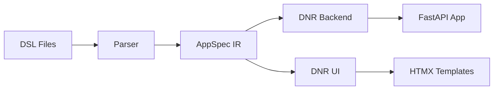

# Dazzle Developer Docs

**DAZZLE** is a DSL-first toolkit for building apps from high-level specifications.

```bash
# Get started in seconds
cd examples/simple_task && dazzle dnr serve
# UI: http://localhost:3000 | API: http://localhost:8000/docs
```

## What is Dazzle?

Dazzle transforms domain specifications written in a human-readable DSL into working applications. Define your entities, surfaces, and workspaces once - get a full-stack app with:

- **FastAPI backend** with automatic CRUD, validation, and OpenAPI docs
- **HTMX frontend** with server-rendered templates and Alpine.js interactions
- **Docker deployment** ready out of the box

## Quick Navigation

<div class="grid cards" markdown>

-   :material-rocket-launch: **Getting Started**

    ---

    Install Dazzle and build your first app in minutes.

    [:octicons-arrow-right-24: Installation](getting-started/installation.md)

-   :material-book-open-variant: **DSL Reference**

    ---

    Complete reference for the Dazzle DSL syntax.

    [:octicons-arrow-right-24: Reference](reference/index.md)

-   :material-code-braces: **Examples**

    ---

    Explore complete example applications.

    [:octicons-arrow-right-24: Examples](examples/index.md)

-   :material-cog: **Architecture**

    ---

    Understand how Dazzle works internally.

    [:octicons-arrow-right-24: Architecture](architecture/overview.md)

</div>

## Core Concepts

### DSL to App Pipeline



### Key Constructs

| Construct | Purpose |
|-----------|---------|
| **entity** | Data model with fields, constraints, computed values |
| **surface** | UI view of an entity (list, detail, create, edit) |
| **workspace** | Collection of surfaces with layout |
| **service** | Custom business logic and operations |
| **integration** | External API connections |

## Example DSL

```dsl
module my_app
app todo "Todo App"

entity Task "Task":
  id: uuid pk
  title: str(200) required
  completed: bool = false

surface task_list "Tasks":
  uses entity Task
  mode: list
  section main:
    field title "Title"
    field completed "Done"
```

## LLM-Friendly Design

Dazzle is built for the AI era:

- **Deterministic generation** - Same input always produces same output
- **Semantic clarity** - DSL constructs map directly to implementation
- **MCP server** - AI agents can introspect and modify Dazzle projects

See [llms.txt](llms.txt) for an agent-oriented overview.

## Getting Help

- **Issues**: [GitHub Issues](https://github.com/manwithacat/dazzle/issues)
- **Discussions**: [GitHub Discussions](https://github.com/manwithacat/dazzle/discussions)
- **Source**: [GitHub Repository](https://github.com/manwithacat/dazzle)
