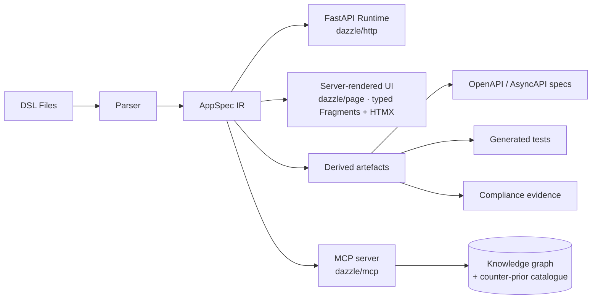

# Dazzle Developer Docs

**DAZZLE** is a DSL-first toolkit for building SaaS apps from high-level specifications.

```bash
# Get started in seconds
cd examples/simple_task && dazzle serve
# UI: http://localhost:3000 | API: http://localhost:8000/docs
```

## What is Dazzle?

Dazzle transforms domain specifications written in a human-readable DSL into working applications. Define your entities, surfaces, workspaces, roles, and row-level rules once; the runtime executes the resulting AppSpec IR directly. The important claim is not just "less code" but inspectable cause and effect:

- **FastAPI backend** with automatic CRUD, validation, and OpenAPI docs
- **Server-rendered UI** using typed Fragments, HTMX, and narrowly-scoped Alpine.js
- **Static and runtime authorization checks** from the same `permit:` / `scope:` model
- **Compliance evidence and API surface inventories** generated from the same IR

If you are evaluating whether to trust that model, start with the skeptical walkthrough rather than the reference docs.

## Quick Navigation

<div class="grid cards" markdown>

-   :material-rocket-launch: **Getting Started**

    ---

    Install Dazzle and build your first app in minutes.

    [:octicons-arrow-right-24: Installation](getting-started/installation.md)

-   :material-shield-check: **Evaluate Dazzle**

    ---

    Verify the core claims with copy-pasteable commands and known gaps.

    [:octicons-arrow-right-24: Skeptical Evaluation](evaluation/evaluation.md)

-   :material-book-open-variant: **DSL Reference**

    ---

    Complete reference for the Dazzle DSL syntax.

    [:octicons-arrow-right-24: Reference](reference/index.md)

-   :material-code-braces: **Examples**

    ---

    Explore complete example applications.

    [:octicons-arrow-right-24: Examples](examples/index.md)

-   :material-cog: **Architecture**

    ---

    Understand how Dazzle works internally.

    [:octicons-arrow-right-24: Architecture](architecture/overview.md)

</div>

## Core Concepts

### DSL to App Pipeline


```mermaid
graph LR
    DSL[DSL Files] --> Parser
    Parser --> IR[AppSpec IR]
    IR --> Back[FastAPI Runtime<br/>dazzle/http]
    IR --> UI[Server-rendered UI<br/>dazzle/page · typed Fragments + HTMX]
    IR --> Derived[Derived artefacts]
    Derived --> OAS[OpenAPI / AsyncAPI specs]
    Derived --> Tests[Generated tests]
    Derived --> Audit[Compliance evidence]
    IR --> MCP[MCP server<br/>dazzle/mcp]
    MCP --> KG[(Knowledge graph<br/>+ counter-prior catalogue)]
```

The runtime executes the IR directly — no code generation step. Every artefact on the right is computed from the same IR. The MCP path is how agents introspect, query, and propose changes; the counter-prior catalogue at `docs/counter-priors/` is the substrate's antipattern-flagging surface, queryable via `knowledge counter_prior`.

### Key Constructs

| Construct | Purpose |
|-----------|---------|
| **entity** | Data model with fields, constraints, computed values |
| **surface** | UI view of an entity (list, detail, create, edit) |
| **workspace** | Collection of surfaces with layout |
| **service** | Custom business logic and operations |
| **process** | Multi-step workflows with state machines |
| **story** | Behavioural user stories for test generation |
| **experience** | Multi-step user flows and wizards |
| **persona** | User roles with goals and permissions |
| **ledger** | Double-entry accounting (TigerBeetle) |
| **integration** | External API connections |
| **message** / **channel** | Messaging, email, and notifications |
| **schedule** | Cron and periodic tasks |

## Example DSL

```dsl
module my_app
app todo "Todo App"

entity Task "Task":
  id: uuid pk
  title: str(200) required
  completed: bool = false

surface task_list "Tasks":
  uses entity Task
  mode: list
  section main:
    field title "Title"
    field completed "Done"
```

## LLM-Friendly Design

Dazzle is built for the AI era:

- **Deterministic generation** - same input should produce the same IR-derived artifacts
- **Semantic clarity** - DSL constructs map to inspectable IR, routes, policies, and UI fragments
- **MCP server** - AI agents can introspect and modify Dazzle projects through structured tools

For a human-first trust path, read [Evaluating Dazzle](evaluation/evaluation.md) and [Security Claims](evaluation/security-claims.md). For the end-to-end authoring loop (spec change → agent edit → validate → tests → human review → deploy), see the [Agent Workflow Guide](guides/agent-workflow.md).

See [Developer Outreach Strategy](evaluation/developer-outreach.md) for the communication model behind these docs. See [llms.txt](llms.txt) for an agent-oriented overview. For watching a running application (health probes, event subsystem, jobs, metrics), see the [Observability Guide](guides/observability.md). For the framework's threat model, the framework-vs-app security responsibility matrix, and the app-developer security checklist, see the [Security Guide](guides/security.md). For where the runtime is fast, where it degrades with data size, and the reproducible benchmark behind those numbers, see the [Performance Envelope](reference/performance-envelope.md).

## Getting Help

- **Issues**: [GitHub Issues](https://github.com/manwithacat/dazzle/issues)
- **Discussions**: [GitHub Discussions](https://github.com/manwithacat/dazzle/discussions)
- **Source**: [GitHub Repository](https://github.com/manwithacat/dazzle)
