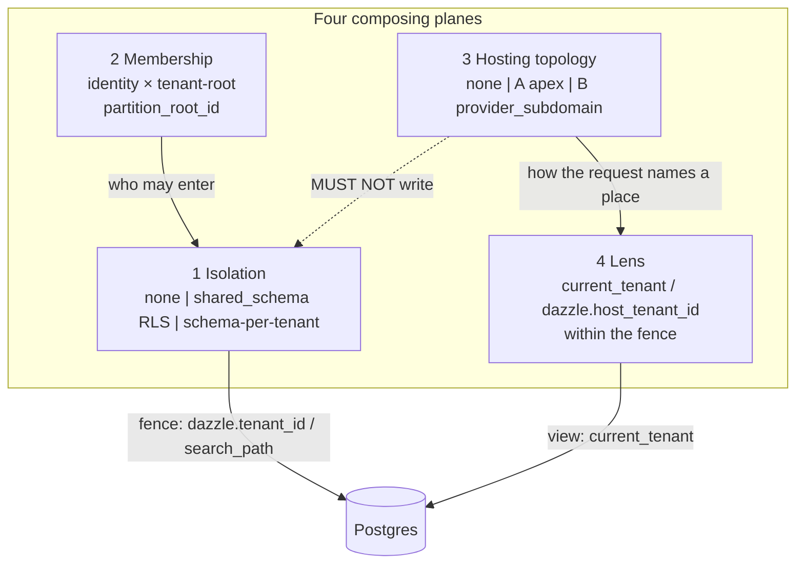
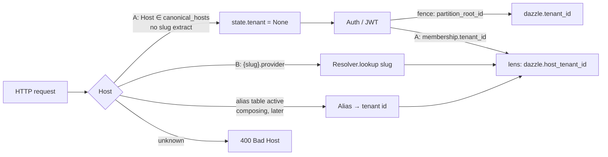
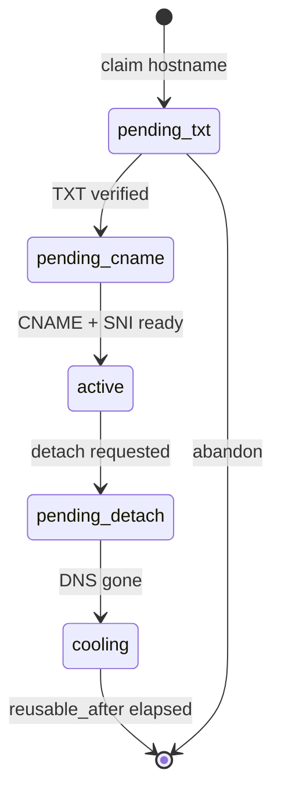

# Dazzle first-class multi-tenant hosting CONOPS

| Field | Value |
|-------|--------|
| **Title** | First-class multi-tenant hosting — concept of operations |
| **Author** | Dazzle (James Barlow / manwithacat) |
| **Date** | 2026-08-30 |
| **Status** | Draft |
| **ADR** | Proposed **ADR-0055** (0054 is the latest numbered ADR; 0034 remains reserved for the RLS-tenancy capstone and is not reused) |
| **Stem** | Proposed `stems/tenancy.md` (none exists today) |
| **Related** | ADR-0003, ADR-0005, ADR-0033, ADR-0036, ADR-0037, ADR-0052; #1651, #1655, #1656, #1657 |

---

## Overview

Dazzle already isolates tenant *data* (`tenancy: mode: shared_schema` RLS fence on `dazzle.tenant_id`; `[tenant] isolation = schema` search_path) and already binds *identity to tenant-root* (framework `memberships.partition_root_id`, ADR-0036/0037). What it does **not** have is a first-class **hosting topology**. Declaring `tenant_host:` today auto-mounts a single topology — `{slug}.{provider-domain}` — and every other shape is a side-effect of `canonical_hosts:` plus `cookie_scope:`. Downstream CyFuture is the other shape: one canonical host (`www.cyfutureuk.com`), tenant from membership. Treating that app as a subdomain-per-org deploy produced three production bugs in one day (v0.112.1–.3): HMAC signing 404 under RLS with no session GUC (#1656), `dsl-run` `__test__/reset` deleting the tenant-root Practice (#1655), and `ApexDiscoveryMiddleware` 302'ing www `/app` onto `{slug}.{domain}` where `__Host-*` cookies cannot follow (#1657).

This CONOPS reconstructs the missing judgement as four **composing planes** (isolation, membership, hosting topology, lens) that must not collapse; names two hosting topologies **A (apex)** and **B (provider_subdomain)**; treats customer domains as a **composing alias probe** (not a third topology token); puts a required `topology:` token on the existing `tenant_host:` block (locality, not a new top-level `hosting:`); and sequences independently shippable PRs so A apps stop inheriting B redirects because topology is **declared**, not because `cookie_scope: host` happens to suppress the bounce.

Single-tenant remains the default. Enabling multi-tenant is isolation + membership + hosting topology — not a collection of host checks sprinkled through middleware.

---

## Background & Motivation

### What already exists (do not invent a parallel model)

Judgement is currently scattered across ADRs, middleware, and per-feature patches. The pieces that are already true:

| Plane | Mechanism | Where |
|-------|-----------|--------|
| **Isolation — shared_schema RLS** | Injected `partition_key` (`tenant_id`); restrictive `tenant_fence`; GUC `dazzle.tenant_id` from `_current_tenant_id` | `tenancy:` DSL; `src/dazzle/core/tenancy_inject.py`; `src/dazzle/http/runtime/tenant_isolation.py`; `pg_backend.connection()` |
| **Isolation — schema-per-tenant** | `search_path` from `_current_tenant_schema`; unbound lease raises `TenantContextError` (#1651) | `[tenant] isolation = "schema"` in `dazzle.toml` (`TenantConfig`); `TenantMiddleware`; `bound_tenant_schema()` |
| **Membership** | Framework `Identity` / `Organization` / `Membership` / `Session`; `membership:` on the tenant-root kind; `partition_root_id` (#1463) | ADR-0037; `src/dazzle/http/runtime/auth/` |
| **Hierarchy** | `tenant_host.parent:` FK edge; `current_tenant` self-or-ancestor compile; aggregate hosts read-only | ADR-0036; `validate_tenant_hierarchy_and_membership` |
| **Host routing (B only)** | `TenantResolutionMiddleware` strips `{slug}.` + `domain`; `ResolvedTenant`; `dazzle.host_tenant_id` | `TenantHostSpec`; `src/dazzle/http/runtime/tenant/middleware.py` |
| **Apex discovery (B bounce)** | Authed GET of `/` `/app` on canonical host → 302 `{slug}.{domain}` **iff** `cookie_scope == "apex"` | `ApexDiscoveryMiddleware`; `resolve_apex_redirect` (#1657 patch) |
| **Cookies** | Name helpers: `host` → `__Host-<app>_session`; planned apex → `__Secure-<app>_admin`. **`set_cookie` never sets `Domain=` today.** `cookie_scope` is the bounce gate only. | `src/dazzle/http/runtime/tenant/cookies.py`; `auth/cookie_name.py`; `auth/routes.py` |
| **CSRF** | Per-request `Origin` host authority == `Host` (works configless under any topology) | ADR-0033 |
| **Lens ≠ fence** | Two tenant-id ContextVars: `_current_tenant_id` (RLS fence GUC) vs `_current_host_tenant_id` (host lens GUC). Schema `search_path` and `dazzle.user_*` attr GUCs are other isolation-plane knobs, not a third tenant-id. | `tenant_isolation.py`; ADR-0036 Layer 1; #1656 |

There is **no** tenancy stem. `stems/INDEX.md` lists dsl-first, rbac-and-scope, clean-breaks, etc. Tenancy judgement is reconstructed from ADR-0036/0037 + `docs/reference/tenant-hosts.md` + three hotfix CHANGELOG entries. Agents therefore treat `tenant_host:` as “the multi-tenant feature,” which is how A became B.

### The production failure class

CyFuture is topology **A**: canonical host(s) only; Host does not name the tenant; membership + RLS do; cookies are `__Host-*`. The app still declared `tenant_host:` (needed for membership-gated login, cookie naming, `current_tenant` scopes, canonical-host pass-through). The runtime inferred topology **B** from the mere presence of that block.

| Issue | Symptom | Collapsed planes |
|-------|---------|------------------|
| **#1657** (v0.112.3) | `ApexDiscoveryMiddleware` 302'd www `/app` to `{slug}.{domain}`. `__Host-*` cookies cannot follow. Session vanished. | Hosting inferred as B; cookie_scope used as a topology proxy |
| **#1656** (v0.112.1) | HMAC `/sign/*` has no session, so `_current_tenant_id` never set; `tenant_fence` hid a valid row as 404. | Host lens used as if it were the fence; HMAC path has no auth dependency |
| **#1655** (v0.112.2) | `POST /__test__/reset` `DELETE`d `archetype: tenant` rows; subsequent host lookup 404'd. | Jobs/tests did not declare “tenant-root is not fixture data” |

#1657's fix — skip the bounce when `cookie_scope != "apex"` — is **correct as a bounce gate** and **insufficient as CONOPS**. In code, `cookie_scope` is **only** that gate (`apex_discovery.py`, `apex_middleware.py`). It is **not** the cookie Domain attribute: `response.set_cookie(...)` in `auth/routes.py` never passes `domain=`, and `choose_session_cookie_name` still issues `__Host-<app>_session` for ordinary members even on a canonical host. `__Host-` cannot carry a Domain and cannot follow a 302. Topology A happens to want host-scoped cookies; that is composition, not identity. An A app that set `cookie_scope: apex` would bounce again and still drop the session. A B app with `cookie_scope: host` (the default — login on the tenant host) correctly does **not** bounce; that is also not “A.”

**PR1 must not advertise `cookie_scope: apex` as “cross-host session sharing works.”** Bounce gating is the #1657 class. Domain wiring is a specified later change (PR2).

### Adjacent leftovers that will keep biting

1. **Client-named tenant.** `TenantConfig.resolver = "header"` / `"session"` (`src/dazzle/core/manifest.py`, `HeaderResolver` / `SessionResolver` in `tenant_middleware.py`), **GraphQL `X-Tenant-ID` override** (`http/graphql/context.py:129–132`, only when `tenant_id` is empty), CORS `allow_headers` including `X-Tenant-ID` (`security_middleware.py` standard and strict profiles), and `src/dazzle/specs/security_docs.py`. Industry constraint: never `?tenant_id=` / body / client header. These are 2026-03 schema-isolation leftovers, not a hosting topology.
2. **Two Host parsers.** `TenantMiddleware.SubdomainResolver` (schema isolation) and `TenantResolutionMiddleware` (`tenant_host:`) both strip `{slug}.{base}`. They must not stay two stories.
3. **`infer_multi_tenancy`** (`mcp/event_first_tools.py`) treats any `tenant_host:` as `shared_schema` and its comment says `current_tenant` scopes “fence its data.” Isolation is inferred from hosting; lens is called a fence. Wrong planes.
4. **Verified-domain join** (`examples/domain_join_co`, `docs/reference/verified-domain-join.md`) proves *email-domain ownership* for membership onboarding. It is **not** HTTP routing and must not become the alias probe.

---

## Goals & Non-Goals

### Goals

1. Bake a **framework stem** (`stems/tenancy.md`) so agents reconstruct four planes instead of “whatever `tenant_host:` does.”
2. Accept **ADR-0055**: topologies A/B are named; custom domains compose as aliases; hosting is a declared fact; host is never folded into the fence.
3. Smallest DSL/IR surface that matches Dazzle locality (ADR-0037 D3 / ADR-0036 rejected top-level `tenancy: tree:`): required `topology:` on `tenant_host:` with tokens `apex` | `provider_subdomain` only.
4. Runtime truth table per topology for apex discovery, cookie naming, `TenantResolutionMiddleware`, signing GUC bind, test reset, JWT.
5. Specify **custom-domain aliases** as a later PR (composing resolver probe + table, TXT+CNAME lifecycle) without building it now and without freezing `custom_alias` in the IR.
6. Independently shippable PRs. **PR1** makes A apps stop inheriting B redirects *because topology is declared*, not only because `cookie_scope: host` suppresses the bounce.

### Non-goals

- Backward-compatible shims (ADR-0003). Missing `topology:` is a validate error (T1); unknown tokens are a parse error; runtime leftover topology never invents B (see [Leftover honesty](#leftover-honesty-one-table)).
- Path-prefix tenancy (`app.com/acme/...`) as a fourth host model.
- Folding `dazzle.host_tenant_id` into `dazzle.tenant_id`.
- Implementing PARKED DDs (DD-001 STI/EAV is unrelated).
- Replacing ADR-0036 hierarchy or ADR-0037 membership. This ADR **adds a fourth declared fact**; it does not reopen three-root alignment.
- Customer-supplied certs, bare-apex custom domains, or DNS-API automation in v1 of aliases.
- A new isolation mode. `TenancyMode.DATABASE_PER_TENANT` stays unused.
- Making domain-join (email TXT) into host routing.
- Multi-root apps (ADR-0037 already deferred).
- A third IR topology token (`custom_alias`). Aliases compose with A or B.

---

## Key Decisions

| # | Decision | Rationale |
|---|----------|-----------|
| K1 | **Four planes: Isolation, Membership, Hosting, Lens.** They compose; they do not collapse. | #1656/#1657/#1655 each collapsed two planes. ADR-0036 already split host lens from RLS fence; hosting vs membership was the missing split. |
| K2 | **Two hosting topology tokens: `apex` (A) and `provider_subdomain` (B).** `none` remains the single-tenant default. Customer domains are a composing alias probe + table, not a third token. | A and B are mutually exclusive Host *stories*. An alias hostname resolves to an existing tenant that already lives under A or B. Exclusive `topology: custom_alias` cannot express “B slug hosts *and* `app.customer.com`.” |
| K3 | **`topology:` lives on `tenant_host:`**, domain-level, required (T1), same agreement class as `cookie_scope` / `canonical_hosts` / `super_admin_role`. Not a top-level `hosting:` / `tenancy: topology:` block. | ADR-0037 D3 and ADR-0036 rejected top-level tenancy blocks for locality. Hosting facts already live on `tenant_host:`. A second place would split the story. See [DSL surface](#dsl--ir-smallest-surface). |
| K4 | **Do not infer topology from `canonical_hosts:` or `cookie_scope:`.** | Both A and B have canonical hosts (B uses them for marketing/admin). `cookie_scope` is the bounce gate today (and, after PR2, the Domain-cookie intent on B). Inference is what shipped the #1657 class. |
| K5 | **Host resolution never writes `dazzle.tenant_id` except proven-token paths.** Signing-on-A: HMAC verify → `SECURITY DEFINER` PK lookup **owned by `dazzle_bypass`** (`GRANT EXECUTE` to `dazzle_app`) → bind fence → re-read as `dazzle_app`. Request **LOGIN** stays `dazzle_app` (A.3). Never `SET ROLE`, never a bypass pool, never `GRANT BYPASSRLS` to `dazzle_owner`. B may keep #1656 host-copy when Host already resolved a tenant. | `FORCE ROW LEVEL SECURITY` subjects the table owner (`rls_schema.py` §1.2). DEFINER-as-`dazzle_owner` with GUC unset still 404s (#1656 inside SQL). `dazzle_bypass` is `BYPASSRLS`; A.3 is “application LOGIN role is not bypass / no superuser session,” not “no function may run as bypass.” |
| K6 | **Host and session/JWT must agree or 403.** Client-supplied tenant (`?tenant_id=`, body, `X-Tenant-ID`) is not a resolver. JWT bind is `bind_jwt_tenant_context` after verify. | Platform-controlled: Host (B), verified alias table (composing), or membership (A). |
| K7 | **Cookies default host-scoped (`__Host-*`, no Domain).** `cookie_scope: apex` is legal only on B. **Today Domain is not wired** (`set_cookie` omits `domain=`; ordinary members still get `__Host-`). PR1 bounce-gate is not “sharing works.” PR2 specifies Set-Cookie: B+apex → `__Secure-<app>_session`, `Domain=.{domain}`. | `__Host-*` cannot follow a 302. Silent 302 is how CyFuture lost the session. Advertising bounce as sharing would freeze the hole. |
| K8 | **Leftover-honest topology tokens.** Parse unknown; validate missing (T1); runtime mappers take `str` and never invent B. Unknown Host on A is 400. Same-host picker/no-orgs are not 400'd because topology was leftover. | Mirrors `cookie_scope`: IR `Literal` after parse; `resolve_apex_redirect(..., cookie_scope="zzz")` → `None`. See [Leftover honesty](#leftover-honesty-one-table). |
| K9 | **Custom domains are aliases of an existing tenant id**, composing with A or B. Attach: TXT + CNAME + SNI. Detach: refuse until DNS gone. No quick slug/id reuse. **Not** `topology: custom_alias`. | Subdomain takeover / dangling DNS. Provider subdomain (or apex membership) remains the identity; customer hostname is a row in `tenant_host_aliases`. |
| K10 | **Jobs and tests declare tenant.** `bound_tenant_schema` (#1651); preserve tenant-root on reset (#1655); no silent `search_path=public`. | Isolation plane is fail-closed off the request path too. |

---

## Proposed Design

### Four planes



Aliases (later) sit **on** plane 3 as a resolver probe, not as a fourth topology token: Host → alias table → same tenant id the A/B story already knows.

**Invariant (link-time, extends ADR-0037 D5):**

> membership root = RLS partition root = hierarchy root
> **and** hosting topology is a fourth **declared** fact, not inferred from `canonical_hosts:`.

The first three roots are already checked by `validate_tenant_hierarchy_and_membership`. Topology is added to `validate_tenant_host_blocks` as a domain-level field (Rule 6 class).

Plane 4 (lens) is **not** a DSL knob in v1. It is implied by topology:

| Topology | What binds `_current_host_tenant_id` | What binds `_current_tenant_id` (fence) |
|----------|--------------------------------------|-----------------------------------------|
| A apex | Auth dependency: active membership's `tenant_id` (the view). Unset on anonymous canonical-host hits (`current_tenant` denies). Reset policy: **task isolation**, same as `_current_tenant_id` — not the B middleware `finally`. | Auth: `partition_root_id`. HMAC: DEFINER PK lookup (function owner `dazzle_bypass`; session still `dazzle_app`) then bind (see D5). Never Host. Never LOGIN as `dazzle_bypass`. |
| B provider_subdomain | `TenantResolutionMiddleware._dispatch_slug` from Host → `ResolvedTenant.id`; **reset in `finally`** (already shipped). | Auth: `partition_root_id`. HMAC: `_partition_root_from_host` when `state.tenant` is set (#1656); else the same DEFINER lookup as A. |
| none | Unset. | Unset (fail-closed) unless the app is not tenant-scoped. |
| Alias (composing, later) | After alias → tenant id, same bind as the app's A or B. | Same as the app's A or B. |

`current_tenant` compilation (ADR-0036 D3) is unchanged: it reads `dazzle.host_tenant_id`. On A there is no host-kind, so hierarchy expansion is a no-op (flat view = membership tenant). Do not invent “hierarchy-on-www” in v1.

### Topologies



Dashed MUST NOT (Host/Isolation) remains the only Host→fence relation: Host resolution does not write `dazzle.tenant_id`. There is **no** `lens --> fence`.

#### A — Apex-only (CyFuture)

- Canonical host(s) only (`www.cyfutureuk.com`). Host does **not** name the tenant.
- Tenant from **membership** (and RLS). `__Host-*`. No slug bounce. Ever.
- `tenant_host:` is still declared: it names `domain`, `canonical_hosts`, cookie policy, membership-gated login, and now `topology: apex`. `slug_field` and `domain` stay required — **entity identity / history / CSRF Origin==Host / absolute URLs**, not Host parsing. Middleware does **not** parse a slug from Host.
- Unknown Host → 400, not “try it as `{slug}.{domain}`.”
- Picker (`/auth/select-org`) and no-orgs (`/auth/no-orgs`) remain same-host paths.

#### B — Provider subdomain (today's `tenant_host:` runtime)

- `{slug}.yoursaas.com`. Host names tenant. Wildcard DNS/TLS. Login on the tenant host by default (`cookie_scope: host`).
- `canonical_hosts` are marketing/admin apex: `request.state.tenant = None`.
- Cross-host **bounce** is opt-in: `cookie_scope: apex` **and** topology B. Cross-host **session sharing** additionally requires PR2 Domain cookies (`__Secure-<app>_session`, `Domain=.{domain}`). Until PR2, a B+apex bounce still drops ordinary members' `__Host-*` sessions — do not document that as working.
- History 301/410 on renamed slugs stays B-only (a slug in the Host is the signal).

#### Custom-domain aliases (later PR — composing, not a topology token)

- `app.customer.com` is an **alias of an existing tenant id** under the app's A or B. Not a new tenant, not a new membership model, not `topology: custom_alias`.
- Resolver checks `tenant_host_aliases` (state=`active`) **before** B slug parse (so `app.customer.com` is not 400'd as a bad provider suffix) and **instead of** A “unknown Host 400” when a row matches.
- `{slug}.{domain}` on a B app **still works**. That is the composition exclusive C forbade.
- Attach: DNS TXT verify + CNAME to a platform target; platform SNI cert.
- Prefer `app.` hostname, **not** bare customer apex, in v1.
- Detach: refuse until the CNAME/TXT is gone; hold the hostname and the tenant slug/id out of the reuse pool for a cooling period (subdomain takeover).

#### `none` — single-tenant default

- No `tenant_host:`. Legacy `dazzle_session` cookie. No Host routing. Isolation may still be `none` (the common case) or, unusually, schema isolation without host routing (dev-only; not a product topology).

### Invariants (normative)

1. **Host resolution never writes `dazzle.tenant_id`.** Proven-token paths (HMAC after DEFINER lookup; JWT after membership match) may bind the fence. Do not generalise #1656 into “host is the fence.”
2. **Host and membership agree when both present.** `check_cross_tenant` already encodes this for B (session `tenant_id` ∈ `{host.id} ∪ ancestor_ids`). A: no host tenant; agreement is JWT/session membership vs itself. Alias: after resolution, same as the app's A or B.
3. **Cookies default host-scoped.** `cookie_scope: apex` is B-only. Bounce (PR1) and Domain cookies (PR2) are separate. Never a silent 302.
4. **Jobs/tests declare tenant.** `bound_tenant_schema` for schema isolation; explicit `set_current_tenant_id` for RLS; `__test__/reset` preserves `archetype: tenant` / `is_tenant_root` rows and re-attaches demo memberships.
5. **Link-time four-fact alignment.** Three roots (ADR-0037 D5) plus declared topology (`apex` | `provider_subdomain`). Hosting is not inferred from `canonical_hosts:`.

### Leftover honesty (one table)

| Surface | Input | Behaviour |
|---------|--------|-----------|
| Parser `topology:` value | Closed set `apex` \| `provider_subdomain`. Unknown (`zzz`, `custom_alias`, …) | `make_parse_error` — same shape as `membership_gated` expects true/false. **Do not coerce to B.** Message may say custom domains are aliases, not a topology token; that does not put `custom_alias` in the IR. |
| Parser `topology:` key missing | Allowed (like optional `cookie_scope`) | Field omitted; IR `topology=None`. |
| Validator T1 | `topology is None` | Hard error: `declare topology: apex \| provider_subdomain — do not infer from cookie_scope.` **T1 owns missing.** Parser does not. |
| IR after successful parse + T1 | `Literal["apex", "provider_subdomain"]` | Tests that build `TenantHostSpec(domain=..., slug_field=...)` pass `topology=`. |
| Runtime mappers | `resolve_apex_redirect(..., topology: str)`, `TenantHostBinding.topology: str`, `_TenantStateMarker.topology: str` | Leftover ≠ `provider_subdomain` → **no slug bounce** (`None`). Picker / no-orgs still same-host. **Do not 400** picker/no-orgs/canonical www because the topology string was leftover. |
| Host parser | Unknown Host on A (not in `canonical_hosts`) | **400 Bad Host** (hostname leftover, not a topology token). |
| Host parser | Runtime `binding.topology` leftover | Treat as A-like: no slug extract, no bounce. Never invent B. |
| `cookie_scope` leftover | `"zzz"` into `resolve_apex_redirect` | Keep existing test: `None`, no invented bounce. |
| `X-Tenant-ID` leftover (after PR3) | Header `zzz` | **Ignored** — does not select a tenant. Not 400 (unknown headers are not topology tokens). |

### Request lifecycle (target)

```mermaid
sequenceDiagram
  participant C as Client
  participant TR as TenantResolutionMiddleware
  participant AD as ApexDiscoveryMiddleware
  participant Auth as Auth / JWT dependency
  participant G as check_cross_tenant
  participant DB as Postgres lease

  C->>TR: Host + cookies
  alt topology A and Host in canonical_hosts
    TR->>TR: state.tenant = None (no slug parse; no host-GUC bind)
  else topology B and Host is tenant hostname
    TR->>TR: resolve slug → ResolvedTenant
    TR->>TR: set_current_host_tenant_id(id)  (reset in finally)
  else alias table active (later, composing)
    TR->>TR: alias → tenant id → same as app A or B
  else Host unknown
    TR-->>C: 400 Bad Host
  end
  TR->>AD: call_next
  alt topology != provider_subdomain
    AD->>AD: never slug-bounce (picker/no-orgs still same-host)
  else topology B and cookie_scope apex and authed GET /
    AD-->>C: 302 https://{slug}.{domain}/
  end
  AD->>Auth: call_next
  Note over Auth: _resolve_auth_context: cookie if present else Bearer; cookie wins
  Auth->>Auth: bind dazzle.tenant_id from partition_root_id
  opt topology A and membership
    Auth->>Auth: set_current_host_tenant_id(membership.tenant_id)
    Note over Auth: A lens uses task isolation like RLS fence; TR finally does not own it
  end
  Auth->>G: Host vs session / JWT claim
  G-->>C: 403 if disagree
  Auth->>DB: connection() sets GUCs from context vars
```

**Reset policy (normative):**

- **B lens:** `TenantResolutionMiddleware._dispatch_slug` `set` / `finally reset` — already shipped. Auth must **not** reset this token.
- **A lens and both fences:** set in the auth/JWT dependency (`bind_jwt_tenant_context` / session auth), same task-isolation story as `_current_tenant_id` in `dependencies.py`. No middleware `finally`. Do not have TR set an A placeholder that auth overwrites (two writers).
- HMAC path: bind fence in `_signing_rls_tenant` try/finally (already the pattern).

### Founder enablement

Single-tenant stays default (no `tenancy:` isolation, no `tenant_host:`). Enabling multi-tenant is **three declarations**, not host checks in handlers:

```dsl
tenancy:
  mode: shared_schema          # plane 1 — isolation, not hosting

entity Practice:
  slug: slug required unique
  tenant_host:
    topology: apex             # plane 3 (A). B: provider_subdomain
    domain: cyfutureuk.com     # still required on A: CSRF Origin==Host, absolute URLs, cookie host
    slug_field: slug           # still required on A: entity identity / history; middleware does not parse Host
    canonical_hosts: [www.cyfutureuk.com, cyfutureuk.com]  # T3: every serving host; apex has no slug Host
    cookie_scope: host         # A forbids apex (T4). Not a topology proxy.
  membership:
    roles: role                # plane 2
```

T3 error copy: **“apex topology has no slug Host; name every serving host in `canonical_hosts`.”**

Plane 4 is runtime. Agents who add a fourth host check in a custom route are reconstructing the pre-CONOPS failure.

---

## Framework stem spec (`stems/tenancy.md`)

Authority: `stems/README.md` — Claim / Reconstruct / Not this / Expressions. Keep it short; this design is the expression.

### Claim

Multi-tenancy is **four planes** that compose and must not collapse: **isolation** (how rows are fenced), **membership** (which identities may enter a tenant-root), **hosting topology** (how HTTP Host names a place — or does not), and **lens** (`current_tenant` / `dazzle.host_tenant_id` inside the fence). Hosting is a **declared** fact (`tenant_host.topology`: `apex` | `provider_subdomain`), never inferred from `canonical_hosts:` or `cookie_scope:`. Customer domains are aliases of an existing tenant, not a third topology token. Single-tenant is the default.

### Reconstruct

- Isolation: `none` | `shared_schema` (RLS `dazzle.tenant_id`) | schema-per-tenant (`search_path`). Not hosting.
- Membership: framework `memberships` + `membership:` on the **root kind** (ADR-0037). `partition_root_id` is the fence key (#1463).
- Hosting: `none` | `apex` (A) | `provider_subdomain` (B). Host, verified alias table (composing), or membership — never `?tenant_id=` / body / `X-Tenant-ID`.
- Lens ≠ fence: two tenant-id ContextVars (`_current_host_tenant_id` vs `_current_tenant_id`). Schema search_path and user-attr GUCs are other isolation knobs.
- Cookies default `__Host-*`. `cookie_scope: apex` is B-only bounce intent; Domain cookies are a separate wiring step.
- Custom domains alias an existing tenant id; they are not `topology: custom_alias`.
- Domain-join email TXT is identity onboarding, not HTTP routing.
- Jobs/tests declare tenant; reset preserves tenant-root.
- Leftover topology tokens: parse error / T1 / mapper `None` — do not invent B.

### Not this

- Treating `tenant_host:` as “the multi-tenant feature” (collapses 2–4 into B).
- Inferring A vs B from `canonical_hosts:` or `cookie_scope:` (#1657 class).
- Folding `dazzle.host_tenant_id` into the RLS fence (#1656 class if generalised).
- Path-prefix tenancy (`/acme/...`) as a fourth host model.
- Client-named tenant (`X-Tenant-ID`, query, body) as a resolver.
- Top-level `hosting:` / `tenancy: topology:` (rejected: locality; see ADR-0055 D2).
- Exclusive `topology: custom_alias` (forbids B slug hosts + customer hostname on one app).
- Silent 302 across hosts with `__Host-*` cookies advertised as “session sharing.”
- Quick reuse of detached slugs/hostnames (dangling DNS / takeover).
- Growing `DATABASE_PER_TENANT` or implementing DD-001.

### Expressions

- This CONOPS; **ADR-0055**; ADR-0036, ADR-0037, ADR-0033, ADR-0005, ADR-0003, ADR-0052
- `docs/reference/tenant-hosts.md`, `docs/reference/verified-domain-join.md`
- `src/dazzle/http/runtime/tenant/{middleware,apex_middleware,cookies,guard,resolver}.py`
- `src/dazzle/http/runtime/tenant_isolation.py` — `_current_tenant_id` vs `_current_host_tenant_id`
- `src/dazzle/http/runtime/auth/apex_discovery.py` — leftover `cookie_scope` does not invent a bounce
- `src/dazzle/core/ir/domain.py` `TenantHostSpec`; `src/dazzle/core/validation/tenancy.py`
- `src/dazzle/signing/routes.py` `_signing_rls_tenant` (#1656)
- `src/dazzle/http/runtime/test_routes.py` `_entity_is_tenant_root` (#1655)
- Fixtures: `fixtures/tenant_hierarchy`; example: `examples/domain_join_co`
- CHANGELOG v0.112.1–.3 (#1656, #1655, #1657)

### INDEX entry

Add to `stems/INDEX.md`:

```
| [tenancy](tenancy.md) | Isolation, membership, hosting topology, and lens are four planes; host is not the fence |
```

Place after `rbac-and-scope` (permit/scope is the sibling split; tenancy is the next split agents miss).

---

## ADR-0055 (proposed)

**Title:** Hosting topology is a declared plane (A apex / B provider-subdomain); aliases compose

**Status:** Proposed
**Date:** 2026-08-30
**Depends on:** ADR-0036 (hierarchy + host lens), ADR-0037 (membership), ADR-0033 (CSRF Origin==Host), ADR-0003 (clean breaks), ADR-0005 (no new singletons)
**Does not replace:** ADR-0034 (reserved RLS capstone), ADR-0036, ADR-0037
**Issues:** #1657, #1656, #1655 (failure class); follow-on implementation issues filed per PR plan

### Context

ADR-0036 named three tenant notions (schema registry, RLS fence, host tenant) and bound `current_tenant` to the **host** GUC. ADR-0037 declared membership at the root. Neither named **how HTTP Host relates to a tenant**. The only implemented relation is B: `TenantResolutionMiddleware` requires Host to be `{slug}.{domain}` or a canonical host, and `ApexDiscoveryMiddleware` was written to bounce apex logins onto slug hosts.

`cookie_scope` was then overloaded as a topology switch (#1657). That is the wrong plane: in code it is only the bounce gate. `set_cookie` does not set Domain.

### Decision

#### D1 — Four planes; hosting is the fourth declared fact

Isolation, membership, hosting topology, and lens compose. Link-time: membership root = RLS root = hierarchy root (ADR-0037 D5) **and** `tenant_host.topology` is present and consistent across a domain. The runtime must not infer A vs B from `canonical_hosts:` or `cookie_scope:`.

#### D2 — Declarative surface: `topology:` on `tenant_host:` (locality)

```dsl
tenant_host:
  topology: apex | provider_subdomain
  domain: example.com
  slug_field: slug
  canonical_hosts: [www.example.com]
  cookie_scope: host
```

`topology:` is **required** when `tenant_host:` is declared (T1, validator-owned). It is **domain-level**: 2+ kinds sharing `domain:` must agree (extend `validate_tenant_host_blocks` Rule 6 alongside `cookie_scope` / `canonical_hosts` / `super_admin_role`).

**Why not a top-level `hosting:` / `tenancy: topology:` block?** ADR-0037 D3 rejected `tenancy: membership:` because membership is a property of one kind and belongs beside `tenant_host:` and `parent:`. ADR-0036 rejected `hierarchy:` / `tenancy: tree:` as “a second place to declare what `tenant_host:` + a domain FK already carry.” Hosting facts (`domain`, `canonical_hosts`, `cookie_scope`) already live on `tenant_host:`. Topology is the same class of fact. A top-level block would split the hosting story and invite agents to declare topology without a tenant kind. Locality wins.

Membership stays on the root kind; topology is domain-level on every `tenant_host:` of that domain (duplicated, agreement-checked) — the same pattern `canonical_hosts` already uses.

#### D3 — Named topologies; leftover tokens stay put; aliases are not a token

| Token | Topology | Host names tenant? |
|-------|----------|--------------------|
| `apex` | A | No. Canonical hosts only. |
| `provider_subdomain` | B | Yes. `{slug}.{domain}`. |

There is **no** `custom_alias` token. Customer hostnames are rows in `tenant_host_aliases` probed by the resolver, composing with the app's A or B.

Unknown parse tokens (`zzz`, `custom_alias`): `make_parse_error`. Missing key: T1. Runtime leftover: mapper `None` / no slug extract — **do not invent B**. Same honesty as `resolve_apex_redirect(..., cookie_scope="zzz")` → `None`.

#### D4 — `cookie_scope` is not topology

- Default `cookie_scope: host`. Today this selects `__Host-*` **names** and (since #1657) suppresses slug bounce. It does **not** set cookie `Domain`.
- `cookie_scope: apex` is **only legal on `topology: provider_subdomain`**. A + apex is a link-time error (T4).
- Apex slug-bounce fires only when **`topology == provider_subdomain` AND `cookie_scope == apex`**. Replacing the #1657 `cookie_scope`-only gate is the load-bearing PR1 behaviour change. That bounce is **not** session sharing until PR2 Domain wiring.
- **PR2 Set-Cookie contract (B + `cookie_scope: apex`):** session cookie name is `__Secure-<app>_session` (**not** `__Host-`, which cannot carry Domain); `Domain=.{marker.domain}`; `Path=/`; `Secure`; `HttpOnly`; `SameSite=Lax`. One write helper (`set_session_cookies` in `auth/cookie_name.py`) used by **every** session `set_cookie` caller (see API / Cookies). `choose_session_cookie_name` / `select_write_name` / `set_session_cookies` read `cookie_scope`, `topology`, and **`domain`** from `_TenantStateMarker` (all stashed in PR1). Super-admin `__Secure-<app>_admin` on canonical host is unchanged. Host-scoped apps keep `__Host-<app>_session` with no Domain.
- **CSRF `dazzle_csrf` stays host-scoped** (no `Domain=`). ADR-0033 Origin-primary admits same-host POSTs after a B+apex bounce without the token following the Domain cookie.
- Open Question “does AegisMark need apex cookies?” waits on this wiring.

#### D5 — Host never writes the fence except proven-token paths

`TenantResolutionMiddleware` continues to set `_current_host_tenant_id` only. `_current_tenant_id` is set by the auth dependency from `partition_root_id`, by `bind_jwt_tenant_context`, or by `_signing_rls_tenant`.

**Signing-on-A (normative, PR2) — `SECURITY DEFINER` PK lookup owned by `dazzle_bypass`; request LOGIN stays `dazzle_app`:**

Tokens remain `record_id:email:expires` (`mint_token` in `signing/tokens.py`). You cannot `repo.read(record_id)` to learn `tenant_id` while `tenant_fence` hides the row.

**Why not owner `dazzle_owner`:** every tenant-scoped table gets `ENABLE` + **`FORCE` ROW LEVEL SECURITY** (`rls_schema.py` §1.2 / `_enable_force_fence`). FORCE exists to close the owner-bypass hole. `dazzle_owner` is `NOLOGIN`, **not** `BYPASSRLS` (`rls_schema.py:739–744`). Under FORCE, a DEFINER function owned by `dazzle_owner` still evaluates `tenant_fence`. The GUC is unset on this lookup (that is the point) → `NULLIF(current_setting(...),'')::uuid` is NULL → row excluded → function returns NULL → 404. Same as #1656, inside SQL. `SET row_security = off` on the function does **not** skip FORCE for a non-BYPASSRLS owner (Postgres still applies policies). **Do not** `GRANT BYPASSRLS` to `dazzle_owner` (reopens FORCE).

**Why not LOGIN as `dazzle_bypass`:** `deployment.md:150–151` — bypass is for excision / ops, **never the app's request path**. rbac-proof **A.3**: the application DB **LOGIN** role does not hold `BYPASSRLS`; no superuser connection serves request paths. A.3 is **not** “no function may run as bypass.” `SET ROLE dazzle_bypass` from `dazzle_app` would require `GRANT dazzle_bypass TO dazzle_app` and give the runtime LOGIN role bypass. `PostgresBackend.connection()` has a single pool (`pg_backend.py:453–490`); `platform=True` only flips `search_path`. Do not add a second bypass pool.

```
HMAC verify token → record_id
  → entity = signable[entity_name]          # closed dict in create_signing_routes; 404 if missing
                                             # URL entity_name NEVER interpolated into SQL
  → tid = _signing_lookup_partition_root(entity, record_id)
       production (LOGIN dazzle_app, RLS enforcing):
         SELECT dazzle_signing_lookup_tenant($1, $2)
           -- $1 = entity.name from the IR object, not the raw path param
           -- SECURITY DEFINER
           -- OWNER dazzle_bypass   -- BYPASSRLS; sees rows with GUC unset
           -- GRANT EXECUTE TO dazzle_app
           -- REVOKE FROM PUBLIC
           -- SET search_path = pg_catalog, public
           -- CASE p_entity of IR-generated WHEN list (signable entities only)
           --   tenant-root kinds (injection skipped, tenancy_inject.py:61): SELECT id
           --   other signable kinds: SELECT <partition_key>
           --   ELSE NULL
           -- parameterized p_id uuid only
       local superuser DATABASE_URL (RLS present but bypassed — deployment.md):
         same PK SELECT on the IR table name (quote_identifier(entity.name))
         via the existing connection(); no DEFINER call required
       function missing / not applied: 503 fail-closed (do not raw-scan as dazzle_app)
  → if tid is None: 404 (same as today; no extra existence oracle)
  → set_current_tenant_id(tid) in _signing_rls_tenant try/finally
  → re-read the row as dazzle_app with the fence bound
```

DDL: emit from `rls_schema` / `build_all_rls_ddl` (owner-capable `dazzle db upgrade`). Create as `dazzle_owner` then `ALTER FUNCTION ... OWNER TO dazzle_bypass` (cluster roles already exist). Regenerated when the signable set changes. The `CASE` list is the second closed set (defence in depth with the Python `signable` dict).

B: if `request.state.tenant` is already set, keep #1656 `_partition_root_from_host`. If not, fall through to the DEFINER lookup. HMAC still must **not** become a general host→fence copy.

Do not mint `tenant_id` into the token. Do not leave signing-on-A deferred. **A.3 stands** — request LOGIN is `dazzle_app`, no `BYPASSRLS`, no superuser session.

Real-PG test (PR2): as `dazzle_app` with GUC unset, `dazzle_signing_lookup_tenant` for a valid signable `record_id` returns the partition id; a non-signable `p_entity` returns NULL; subsequent `repo.read` as `dazzle_app` after bind succeeds.

On topology A, after authentication, bind `_current_host_tenant_id` from `active_membership.tenant_id` so `current_tenant` scopes have a lens. That is **membership → lens**, not host → fence. Reset: task isolation (see lifecycle).

#### D6 — Client-supplied tenant is not a resolver

Production resolvers: Host (B), verified alias table (composing), membership (A). Forbidden: `?tenant_id=`, JSON body tenant, `X-Tenant-ID` as authority. `TenantConfig.resolver = "header"|"session"` is not a product topology.

**Same clean break (PR3):** delete GraphQL override, `HeaderResolver` / `SessionResolver`, CORS `allow_headers` `X-Tenant-ID` (both profiles in `security_middleware.py`), and the generated mention in `src/dazzle/specs/security_docs.py`. Leftover test: `X-Tenant-ID: zzz` does not select a tenant (ignored). Local dev uses `DAZZLE_TENANT_SLUG` / `DAZZLE_HOST_TENANT_SLUG` (server-controlled env, not the client).

#### D7 — Path-prefix tenancy is forbidden

`app.com/acme/...` is not a topology. Do not add it.

### Consequences

- New IR field `TenantHostSpec.topology: Literal["apex", "provider_subdomain"] | None = None`. Missing is T1, not pydantic-at-parse. After T1 it is one of the two tokens.
- Parser: `"topology"` in `_TENANT_HOST_ALLOWED_KEYS`; closed values `apex` | `provider_subdomain` via `make_parse_error` (mirror `membership_gated`).
- Validator: T1 required; domain agreement; A requires non-empty `canonical_hosts` (T3 copy as above); A forbids `cookie_scope: apex`.
- Runtime: `app_factory` passes topology into `TenantResolutionMiddleware`, `ApexDiscoveryMiddleware`, and **`_TenantStateMarker`** (`topology`, `cookie_scope`, **`domain`** — PR1, so `app.state` is not a second inferred channel). Runtime mappers take `str`.
- Clean break: every `tenant_host:` in-tree (fixtures, examples, **all test DSL strings and `TenantHostSpec(` constructors**) gains an explicit `topology:` in the same change. CHANGELOG `### Changed`.
- Downstream (CyFuture, AegisMark) update on bump: CyFuture `topology: apex`; AegisMark `topology: provider_subdomain`. `cookie_scope: apex` only after PR2 Domain wiring if they truly share sessions across slug hosts.

### Failure-modes check

1. **Which failure mode?** Authority leak (wrong tenant fence from Host) and silent under-grant (A bounced off its session). Mitigated by D4/D5 and fail-closed leftover tokens.
2. **Detector?** RLS fence (backstop), `dazzle validate` (topology required + A/B cookie rules), unit tests on `resolve_apex_redirect` keyed by topology, leftover-honesty case, `dazzle_apex_bounce_total{topology="apex"}`.
3. **Live in normal workflow?** Yes — validate every build; RLS every request.
4. **Traceable to DSL?** `tenant_host.topology` + `cookie_scope` + `canonical_hosts` determine routing; inspectable in IR.
5. **Postgres/auth/RLS preserved?** Yes — no new isolation primitive; two tenant-id ContextVars stay separate. Signing lookup is DEFINER PK-only owned by `dazzle_bypass`; request LOGIN remains `dazzle_app` (A.3). FORCE RLS on `dazzle_owner` is not reopened.

---

## DSL / IR (smallest surface)

### Argument (do not silently pick the rejected alternative)

| Option | Verdict |
|--------|---------|
| **`topology:` on `tenant_host:`** (chosen) | Hosting facts already live here. Domain-level agreement already exists. Matches ADR-0037 D3 locality and ADR-0036's rejection of a second tenancy block. |
| Top-level `hosting:` / `tenancy: topology:` | Rejected. Membership is per-kind; hosting is per-domain but already *expressed* on `tenant_host:`. A top-level block is the alternative ADR-0036/0037 explicitly rejected. Revisit only if multiple independent domains need different topologies in one app *and* duplication becomes error-prone — not now. |
| Infer from `cookie_scope` / `canonical_hosts` | Rejected. That *is* the #1657 bug. |
| New entity `HostTopology` / app-owned table | Rejected. Topology is IR, not rows. The **alias** table is rows (hostnames), not topology. |
| Exclusive `topology: custom_alias` | Rejected — Alternative 7. Cannot compose B slug hosts with a customer hostname. |

### IR

```python
# src/dazzle/core/ir/domain.py — TenantHostSpec
class TenantHostSpec(BaseModel):
    model_config = ConfigDict(frozen=True)

    # None until T1; after validate, one of the two tokens.
    # Not a required pydantic field so the parser can construct without it
    # and T1 owns the “declare topology…” message.
    topology: Literal["apex", "provider_subdomain"] | None = None
    domain: str
    slug_field: str
    canonical_hosts: list[str] = Field(default_factory=list)
    cookie_scope: Literal["host", "apex"] = "host"
    super_admin_role: str = "super_admin"
    history_entity: str | None = None
    not_found_template: str | None = None
    expired_template: str | None = None
    order: int | None = None
    membership_gated: bool = True
    parent: str | None = None
```

Do **not** add `custom_alias` to this Literal in PR1.

### Parser

- Add `"topology"` to `_TENANT_HOST_ALLOWED_KEYS` in `dsl_parser_impl/entity.py`.
- Closed values, mirror `membership_gated`:

```python
elif key == "topology":
    val_tok = self.expect_identifier_or_keyword()
    if val_tok.value not in ("apex", "provider_subdomain"):
        raise make_parse_error(
            "tenant_host: topology expects apex or provider_subdomain, "
            f"got {val_tok.value!r}",
            self.file, val_tok.line, val_tok.column,
        )
    fields[key] = val_tok.value
```

- Missing key: omit (T1). Do not default to `provider_subdomain`.
- Grammar regen in PR1 from the allowed-key set (do not copy the stale subset). Include shipped keys **`membership_gated`**, **`parent`**, and **`topology`**:

```ebnf
entity_tenant_host_block = "tenant_host" ":" NEWLINE INDENT
    tenant_host_field+
    DEDENT ;

tenant_host_field =
    "topology"           ":" ("apex" | "provider_subdomain") NEWLINE
  | "domain"             ":" string  NEWLINE
  | "slug_field"         ":" IDENT   NEWLINE
  | "canonical_hosts"    ":" "[" host_list "]" NEWLINE
  | "cookie_scope"       ":" ("host" | "apex") NEWLINE
  | "super_admin_role"   ":" IDENT   NEWLINE
  | "history_entity"     ":" IDENT   NEWLINE
  | "not_found_template" ":" dotted_callable NEWLINE
  | "expired_template"   ":" dotted_callable NEWLINE
  | "order"              ":" NUMBER  NEWLINE
  | "membership_gated"   ":" ("true" | "false") NEWLINE
  | "parent"             ":" IDENT   NEWLINE ;
```

Parser `_TENANT_HOST_ALLOWED_KEYS` remains the closed set; EBNF is generated from it (`grammar_gen.py` + `docs/reference/grammar.md`).

### Link-time rules (extend `validate_tenant_host_blocks`)

| ID | Rule |
|----|------|
| T1 | Every `tenant_host:` has `topology` set. Message: `declare topology: apex \| provider_subdomain — do not infer from cookie_scope.` **Owns missing.** |
| T2 | Kinds sharing a `domain:` agree on `topology` (Rule 6 list += `"topology"`). |
| T3 | `topology: apex` requires non-empty `canonical_hosts`. Message: **`apex topology has no slug Host; name every serving host in canonical_hosts.`** |
| T4 | `topology: apex` ⇒ `cookie_scope == "host"`. |
| T6 | `domain` remains a syntactically valid host on A (CSRF / absolute URLs). Slug extraction is what A disables, not the domain declaration. |

No T5 `custom_alias` rule — the token is not in the language.

Update `docs/reference/tenant-hosts.md`: topology is required; stop describing `cookie_scope: host` as “so apex discovery does not 302” — bounce is **topology B ∧ cookie_scope apex**. Note honestly that Domain cookies are not wired until PR2; login integration is no longer “planned” as a vague footnote — it has a Set-Cookie contract.

### Callers in the same change (ADR-0003)

PR1 updates every in-tree `tenant_host:` / `TenantHostSpec(` including:

- `fixtures/tenant_hierarchy/dsl/domain.dsl` — `topology: provider_subdomain`
- `examples/domain_join_co/dsl/domain.dsl` — `topology: provider_subdomain` (join success path is the org host)
- `tests/unit/test_tenant_host_parser.py` (including `test_parser_defaults_when_block_minimal` — still parses without topology, then T1 if validated; parser unit test may omit; validator tests must fail T1)
- `tests/unit/test_tenant_host_validator.py`
- `tests/unit/test_tenant_hierarchy_1394.py`
- `tests/unit/test_membership_relation_1393.py`
- `tests/unit/test_auth_identity_validation.py`
- `tests/unit/test_tenancy_inference.py`
- `tests/integration/test_current_tenant_scope_pg.py`
- Any other `TenantHostSpec(` constructor (pass `topology=`)

`infer_multi_tenancy` in **PR1**: stop returning `mode: "shared_schema"` solely from `tenant_host:`. Signal `tenant_host` as **hosting**; recommend two actions: declare `tenancy:` (isolation) **and** `topology:` (hosting). Do not call `current_tenant` a fence in the comment.

---

## API / Interface Changes

### DSL / IR

- New field `tenant_host.topology` (`apex` | `provider_subdomain` | `None` pre-T1).
- No new top-level block. No `custom_alias`. No change to `membership:` or `tenancy:` isolation.

### Runtime constructors

```python
@dataclass(frozen=True)
class TenantHostBinding:
    app_name: str
    domain: str
    topology: str  # leftover-honest; mappers exact-match "provider_subdomain" / "apex"
    canonical_hosts: tuple[str, ...]
    cookie_scope: str
    cache: TenantCache
    resolver: Resolver
    ...
```

**PR1:** `_stash_tenant_state_marker` adds to `_TenantStateMarker`:

- `topology: str`
- `cookie_scope: str`
- **`domain: str`** — the `tenant_host.domain` suffix (Rule 6 / grouping key). `set_session_cookies` reads `Domain=.{marker.domain}`. **Do not parse Domain from `Host`** (that would be `{slug}` or `www`, not the cookie suffix).

Today the marker is only `app_name`, `canonical_hosts`, `super_admin_role` (`app_factory.py:96–104`). Guard/signing/JWT still PR2; they read the marker rather than guessing from `canonical_hosts`.

`ApexDiscoveryMiddleware.__init__` gains `topology: str`. `resolve_apex_redirect` gains `topology: str` and **stops treating cookie_scope as the bounce bit in isolation**:

```python
def resolve_apex_redirect(..., topology: str, cookie_scope: str = "host") -> str | None:
    outcome = resolve_activation(...)
    if isinstance(outcome, NeedsPicker):
        return PICKER_PATH
    if isinstance(outcome, NoOrgs):
        return NO_ORGS_PATH if memberships_required else None
    if isinstance(outcome, Activated):
        if topology != "provider_subdomain":
            return None  # leftover topology: no invented B bounce; do not 400
        if cookie_scope != "apex":
            return None
        ...
        return f"https://{slug}.{domain}/"
    return None
```

### Cookies / JWT

**Cookies (honest now, specified PR2):** helpers today only name `__Host-<app>_session` / `__Secure-<app>_admin`. `select_write_name` does not read `cookie_scope`. Every `response.set_cookie` omits `domain=`. PR2 wires D4 via **one write helper**. Cookie helpers are **not** “unchanged.”

`set_session_cookies(response, request, *, session_id, csrf_secret, user_roles, default_cookie_name, max_age=None)` in `auth/cookie_name.py`:

- Session cookie: `select_write_name` + `httponly=True` + `secure=cookie_secure` + `samesite=lax`. When topology B ∧ `cookie_scope: apex` ∧ the chosen name is `__Secure-<app>_session`, pass `domain=.{marker.domain}` (`_TenantStateMarker.domain` stashed in PR1) and `path="/"`. Never derive Domain from the request `Host`. Never pass `domain=` on a `__Host-` name (browser would reject).
- CSRF cookie: always `dazzle_csrf`, `httponly=False`, **no Domain** (host-scoped). Origin-primary (`csrf_admits`: Origin==Host) admits post-bounce same-host POSTs without the CSRF cookie following.

**Every session `set_cookie` must go through that helper.** Callers today (all omit `domain=`):

| Module | What it sets |
|--------|----------------|
| `auth/routes.py` | login / signup / logout session + CSRF |
| `auth/password_login_routes.py` | form login session + CSRF |
| `auth/sso_session.py` `finish_login_session` | SSO completion (OIDC/SAML tail) |
| `auth/sso_routes.py` | any remaining SSO session cookies |
| `auth/routes_2fa.py` | 2FA verify session + CSRF |
| `auth/two_factor_form_routes.py` | 2FA form session + CSRF |
| `auth/magic_link_routes.py` | magic-link consume session + CSRF |
| `auth/org_context_routes.py` | org-switch re-issue |
| `auth/invitation_routes.py` | accept-invite session |
| `qa_secure_routes.py` | QA mint (ADR-0035) — still the session helper so names match; topology A stays `__Host-*` |

Not session cookies (do **not** Domain-scope): `consent_routes.py`, `experience_routes.py`, `locale_routes.py`, `test_routes.py` harness cookies.

**JWT — `bind_jwt_tenant_context` (PR2), not inside `JWTMiddleware`.** `JWTMiddleware` is a helper class, **not** `app.add_middleware` (`jwt_middleware.py`; `routes_jwt.py` constructs it ad-hoc). `create_auth_dependency.get_current_user` **401s when `read_session_id` is empty** (`auth/dependencies.py:137–138`) and never looks at Bearer. `create_deny_dependency` / `create_optional_auth_dependency` likewise cookie-only. Generated CRUD therefore never sees `request.state.jwt_auth`.

PR2 wiring (cookie wins):

1. App factory stashes one verifier on `app.state.jwt_verifier` (`JWTMiddleware` wrapping `JWTService`) — ADR-0005, not a module singleton. No Starlette middleware required; the dependency calls `get_auth_context`.
2. Shared `_resolve_auth_context(request, auth_store, cookie_name) -> AuthContext` used by **all three** factories (`create_auth_dependency` / `create_deny_dependency` / `create_optional_auth_dependency`):
   - `session_id = read_session_id(...)`. If present → `validate_session` as today. **Do not consult `Authorization`.** A Bearer header cannot override a host-bound session cookie.
   - Else → `jwt_verifier.get_auth_context(request)`. If not authenticated: empty context (optional/deny) or 401 (require).
   - Bearer success → `bind_jwt_tenant_context(request, jwt_auth, auth_store)` then `_enforce_cross_tenant` / `_bind_rls_tenant_id` as today (or the bind lives inside `bind_jwt_tenant_context` and `_bind_rls_tenant_id` is a no-op if already set).
3. `bind_jwt_tenant_context` order: `claims.sub` is the user id (`JWTClaims.user_id`) = `memberships.identity_id`; `memberships = auth_store.get_memberships_for_identity(sub)`; if `claims.tenant_id` present it must be an **active** membership (or, on B, `ResolvedTenant.id` ∪ ancestors) else **403**; if absent, Host (B) or sole membership (A) / 403 if none/many and gated; bind fence from `partition_root_id`; A lens from `membership.tenant_id` (task isolation). Never read GraphQL/`X-Tenant-ID`.
4. `jwt_middleware.py` stays verify-only.

Guard matrix row for Bearer: cookie_kind `None`; session_tenant_id from the membership chosen above; same Host agreement as session.

### Schema-isolation resolver

See D6 / PR3. `DAZZLE_*_SLUG` env remains.

### CSRF

No change. ADR-0033 Origin==Host is per-request and topology-agnostic.

---

## Data Model Changes

### v1 (A/B) — none

No new tables. `public.tenants` (schema registry) stays operational/lifecycle (ADR-0036 D1). Memberships unchanged.

### Aliases (later) — table (framework, not app-owned)

Proposed name: `tenant_host_aliases` (framework schema, next to `organizations` / `memberships` — not an IR entity authors reinvent).

| Column | Type | Notes |
|--------|------|--------|
| `id` | uuid pk | |
| `tenant_id` | uuid not null | Existing tenant-root id (FK to organizations / tenant-root). **Alias, not a new tenant.** |
| `hostname` | text unique not null | Lowercased `app.customer.com`. No port, no scheme. |
| `state` | text not null | `pending_txt` → `pending_cname` → `active` → `pending_detach` → (row held / deleted after cooling) |
| `txt_token` | text not null | Unpredictable; `dazzle-verify=<token>` |
| `verified_at` | timestamptz null | |
| `attached_at` | timestamptz null | |
| `detach_requested_at` | timestamptz null | |
| `reusable_after` | timestamptz null | Cooling; slug/hostname not issued before this |

No customer-supplied cert columns in v1 (platform SNI only). No path prefix column. No topology column — the app's `tenant_host.topology` already says A vs B.

**Migration:** Alembic via the engine (ADR-0045/0017) when aliases ship. Not in PR1.

**Detach:** API refuses `state=active` → gone until DNS TXT/CNAME lookup shows the records absent (or TTL-bounded re-check). Then `pending_detach` until `reusable_after`. Tenant slug/id reuse uses the same cooling (history_entity 410 already covers B slugs; alias hostnames need the alias row).

---

## Runtime behaviour table

Legend: **keep** = current code is already correct for that topology; **change** = PR behaviour.

| Concern | A `apex` | B `provider_subdomain` + `cookie_scope: host` | B + `cookie_scope: apex` | Alias probe (later, composing) |
|---------|----------|-----------------------------------------------|--------------------------|--------------------------------|
| **Host parse** (`TenantResolutionMiddleware.dispatch`) | Host ∈ `canonical_hosts` → `state.tenant=None`. Else **400** (no slug strip). **Change** vs today (today unknown hosts that still end with `.{domain}` are treated as slugs). | Keep: suffix match, slug extract, resolver, 301/410 history. Canonical → tenant None. | Same as B host. | Active alias hostname → `ResolvedTenant` of aliased tenant **before** B slug parse / instead of A 400. `{slug}.{domain}` on B still works. |
| **`dazzle.host_tenant_id`** | Unset in TR. Auth dependency binds membership `tenant_id`; **task isolation** (no TR `finally`). **Change** (today stays None on www → `current_tenant` denies). | Keep: `set_current_host_tenant_id(str(result.id))` in `_dispatch_slug` + `finally`. | Keep. | Same as the app's A or B after alias resolve. |
| **`dazzle.tenant_id` fence** | Auth: `partition_root_id`. Never Host. HMAC: **DEFINER PK lookup** then bind (D5). **Change.** | Auth: `partition_root_id`. HMAC: `_partition_root_from_host` when `state.tenant` set (#1656) **keep**; else DEFINER lookup. | Keep. | Same as the app's A or B. |
| **Apex discovery** (`resolve_apex_redirect`) | **Never** slug URL. Picker / no-orgs same-host. **Change (PR1):** gate on `topology != provider_subdomain`. Leftover topology → `None` bounce, **not** 400. | No slug bounce (cookie_scope host). Picker / no-orgs keep. Leftover cookie_scope stays put. | Single active membership → `https://{slug}.{domain}/`. **Session does not follow until PR2 Domain cookies.** | No extra bounce to provider slug. Customer host *is* a tenant hostname. |
| **Cookie naming** | `__Host-<app>_session` only. | `__Host-<app>_session` on tenant host. **Keep.** | **Today (honest):** still `__Host-` for members; bounce drops session. **PR2:** `__Secure-<app>_session`, `Domain=.{domain}`. Super-admin `__Secure-<app>_admin` on canonical. | `__Host-*` on `app.customer.com` (that host *is* the cookie host). Sharing with `{slug}.{domain}` is B+apex Domain cookies, not v1 alias. |
| **Cross-tenant guard** (`check_cross_tenant`) | `request_tenant_id` is None (canonical). Host-bound cookie + no request tenant currently raises `HostCookieMissingTenant`. **Change (PR2):** on A, canonical + host cookie **PASS iff session membership exists**. Do not allow that cookie on a *different* host. | Keep truth table (#1518 id-based, ancestor set). | Keep. Apex cookie only with super_admin. | Same as the app's A or B against aliased tenant id. |
| **Signing GUC** (`_signing_rls_tenant`) | HMAC → `dazzle_signing_lookup_tenant` DEFINER **owned by `dazzle_bypass`** (LOGIN still `dazzle_app`; or local-superuser PK SELECT) → bind fence → re-read `dazzle_app`. Table from `signable` dict. **Not** host copy. **Change (PR2).** | Keep host-copy when no session tenant and Host resolved. Else DEFINER lookup. Still do not fold GUCs. | Keep. | Same as the app's A or B. |
| **JWT** (`bind_jwt_tenant_context`) | Via `_resolve_auth_context` in all three auth factories: cookie if present else Bearer. Claim present → must be an active membership of `sub`; bind fence from `partition_root_id`, lens from that membership. Absent → sole membership or 403. **Change (PR2).** | Same factories. Claim present → must equal `ResolvedTenant.id` ∪ ancestors. Absent → Host. Mismatch 403. Cookie wins if both presented. | Same. | Claim vs aliased tenant id. |
| **Test reset** (`test_routes._reset_test_data`) | Keep: skip `_entity_is_tenant_root`; re-attach demo memberships (#1655). Leftover persona slugs in body stay put. | Keep. | Keep. | Preserve alias rows or they 404 like tenant-root. |
| **Jobs** | `set_current_tenant_id` / membership; no Host. Schema isolation: `bound_tenant_schema` (#1651). | Same plus optional Host in worker envelope if the job was enqueued from a host. | Same. | Same as the app's A or B. |
| **CSRF** | Origin host == Host. Keep. | Keep. | Keep. Cross-host form posts fail Origin gate until Domain cookies exist (correct). | Keep. |
| **Demo env** `DAZZLE_HOST_TENANT_SLUG` | Allowed for capture on localhost (existing). Does not change topology. | Keep. Skip `/__test__`. | Keep. | N/A. |
| **Leftover tokens** | See [one table](#leftover-honesty-one-table). | Same. | Same. | Unknown hostname: 400, not “maybe a slug.” |

### Guard change (A) — precise

Today (`guard.py` `cookie_kind == "host"` + `request_tenant_id is None`) → `HostCookieMissingTenant`. That is right for **B** (host cookie presented on marketing apex). It is wrong for **A** (www *is* the app). Branch on **`_TenantStateMarker.topology`** (stashed PR1):

- A + host cookie + canonical Host → PASS iff `session_tenant_id` is set; 403 if not (fail-closed, same as #1518).
- B + host cookie + canonical Host → keep `HostCookieMissingTenant`.

Do not implement this as “if cookie_scope == host.” That would again collapse planes (B default is also host cookies, and presenting them on B's marketing apex must still 403).

### JWT / Bearer guard row

| Cookie | Tenant claim | Host tenant | Result |
|--------|--------------|-------------|--------|
| none (Bearer) | absent | B resolved | PASS; fence from Host partition root after membership check if gated |
| none (Bearer) | present, matches Host ∪ ancestors (B) or an active membership (A) | any | PASS; bind that membership |
| none (Bearer) | present, mismatch | any | 403 |
| none (Bearer) | present, not in memberships | A canonical | 403 |

---

## Topology C aliases (later PR — specification only)

### What aliases are

A **hostname alias** of a tenant that already exists under the app's A or B. Resolution: `Host` → `tenant_host_aliases` (state=`active`) → tenant id → same `ResolvedTenant` / membership / RLS path. On B, `{slug}.{domain}` continues to resolve. On A, an alias is the unusual “customer domain points at an apex-only product” case — allowed because aliases compose, not because A became C.

Not: a new isolation mode, a new membership table, a new topology token, or “custom domain tenancy.”

### Attach lifecycle



1. Operator (tenant admin with a new capability, e.g. `manage_host_aliases`) claims `app.customer.com`.
2. Platform shows `TXT` at `_dazzle-challenge.app.customer.com` (or root TXT) with unguessable token.
3. Verify (CLI analogue of `dazzle auth connection verify-domain` — **new** command, not reused domain-join). Fail-closed if TXT missing/mismatched.
4. Customer CNAMEs `app.customer.com` → platform target (`customers.yoursaas.com` or per-tenant `{slug}.{domain}`). Platform provisions SNI cert (ACM / equivalent). No customer-supplied certs in v1.
5. Mark `active`. Resolver checks alias table **before** B slug parse / A unknown-Host 400.

### Detach

- Request detach → `pending_detach`. Continue serving until DNS is gone so we don't 410 while DNS still points here (orphan takeover the other way).
- Refuse **new** attach of that hostname until lookups show CNAME/TXT gone **and** `reusable_after` (recommend ≥ 24h, ≥ max TTL observed).
- Tenant slug/id: keep existing B history 301/410; do not recycle slug while any alias is `active` or in cooling.

### What is NOT in v1 of aliases

| Out | Why |
|-----|-----|
| Bare customer apex (`customer.com` without `app.`) | APEX CNAME is not universally valid; ALIAS/ANAME is DNS-vendor-specific. Prefer `app.` |
| Customer-supplied certs / BYO ACM | Ops + key-handling surface |
| Path tenancy | Forbidden (D7) |
| Domain-join email TXT as host proof | Different plane (identity) |
| Multiple aliases per tenant | Can relax later; v1 one active hostname keeps cookies/SNI simple |
| Automatic registrar APIs | Out of band |
| `topology: custom_alias` | Would forbid composition with B slug hosts |

### Runtime once aliases exist

- Alias cache next to `TenantCache` (positive + NEGATIVE). `dazzle.tenant.bust` grows a hostname form.
- TLS: wildcard on provider domain covers B; aliases need per-hostname certs (Let's Encrypt / ACM). Document ops; don't pretend `tenant_host.domain` wildcard covers customer names.
- Cookies: `__Host-*` on the customer hostname. Session does **not** silently work on `{slug}.{domain}` too (that would be cross-host). If a product wants both names live, that is `cookie_scope: apex` on B **plus PR2 Domain cookies** — not alias v1.

---

## Alternatives Considered

### 1. Infer topology from `cookie_scope` + `canonical_hosts` (status quo + #1657)

**Pros:** Zero DSL change; CyFuture already uses `cookie_scope: host`.
**Cons:** Collapses cookies with hosting. B's default is also `host`. Both A and B have canonical hosts. Leftover `cookie_scope` honesty is not a topology declaration. Agents will keep reconstructing B.
**Rejected.**

### 2. Top-level `hosting:` / `tenancy: topology:` block

**Pros:** Topology is app-global; one declaration.
**Cons:** ADR-0037 D3 and ADR-0036 already rejected top-level tenancy blocks for locality and “second place to declare.” Hosting knobs already live on `tenant_host:`. A top-level block without a tenant kind is an incomplete app.
**Rejected** (revisit only if multi-domain mixed topologies become real).

### 3. Default `topology: provider_subdomain` when omitted

**Pros:** Smaller clean break.
**Cons:** Re-introduces A-inherits-B for any app that forgets the field (CyFuture's original failure). Leftover-honesty: missing token must not invent B.
**Rejected.** T1 required field.

### 4. Path-prefix tenancy as another topology

**Pros:** Some enterprise reverse proxies already strip prefixes.
**Cons:** Breaks `__Host-*` (cookie path), CSRF Origin/Host, relative URLs, HTMX; a fourth model. Industry constraint forbids growing it.
**Rejected.**

### 5. Fold `dazzle.host_tenant_id` into `dazzle.tenant_id`

**Pros:** One GUC. HMAC 404 “just works.”
**Cons:** ADR-0036 Layer 1 exists because they diverge (root member on school host: fence=trust, lens=school). #1656's own comment forbids this.
**Rejected.**

### 6. Keep `X-Tenant-ID` / header resolver for “API clients”

**Pros:** Convenient for curl.
**Cons:** Client-named tenant is a confused deputy. JWT claim + Host/membership already serve APIs. Env override remains for local.
**Rejected** as a product resolver.

### 7. Exclusive `topology: custom_alias` as a third token

**Pros:** One field, three names; T2 agreement is trivial.
**Cons:** An app cannot declare both `{slug}.{domain}` and `app.customer.com` if the domain-level token is mutually exclusive. K9 (“alias of an existing tenant”; CNAME to `{slug}.{domain}`) **is** B+alias composition. “A+C is unusual” is the same composition. Freezing `custom_alias` in the PR1 Literal would encode the wrong Host story.
**Rejected.** Aliases are a composing resolver probe + `tenant_host_aliases`. A/B remain the only topology tokens.

### 8. Mint `tenant_id` into the HMAC signing payload (signing-on-A)

**Pros:** No extra SQL on the request path.
**Cons:** Clean-breaks the token format; invalidates outstanding emailed links (`record_id:email:expires`). HMAC already proves `record_id`; a DEFINER PK lookup is enough.
**Rejected** in favour of D5 `SECURITY DEFINER`.

### 9. Request-path `dazzle_bypass` / `SET ROLE` / second bypass pool for signing-on-A

**Pros:** Obvious “just SELECT.”
**Cons:** `deployment.md` forbids bypass on the app request path; A.3 forbids BYPASSRLS on the application role; `GRANT dazzle_bypass TO dazzle_app` *is* giving the runtime role bypass; `PostgresBackend` has one pool and `platform=True` is not BYPASSRLS; `dazzle_bypass` already has DML on all public tables so “PK SELECT only” is discipline. `/sign/*` is a normal user GET.
**Rejected** as a *session*. D5 is `SECURITY DEFINER` **owned by `dazzle_bypass`**; the request LOGIN remains `dazzle_app`. Owning the function as `dazzle_owner` is also rejected: FORCE RLS still fences the owner (`rls_schema.py` §1.2). Do not `GRANT BYPASSRLS` to `dazzle_owner`.

---

## Security & Privacy Considerations

### Threat model (hosting-relevant)

| Threat | Severity | Mitigation |
|--------|----------|------------|
| **Subdomain takeover** (dangling CNAME / reused slug) | High | History 410 on B; alias cooling + refuse detach while DNS live; reserved `qa_` slugs (`tenant/config.py`) |
| **Silent cross-host 302 dropping `__Host-*`** | High | Topology A never bounces; B bounce only with `cookie_scope: apex`; Domain cookies required for sharing (PR2) — do not claim sharing in PR1 |
| **Host → fence copy as general rule** | High | D5; two tenant-id ContextVars; HMAC DEFINER is PK-only; B host-copy stays Host-resolved only |
| **Client-named tenant** (`X-Tenant-ID`, query) | High | D6; PR3 removes GraphQL, header/session resolvers, CORS allow-list, security-docs mention |
| **Host / JWT / session disagreement** | High | Guard 403; `bind_jwt_tenant_context` claim match when present |
| **CSRF across tenant hosts** | Medium | ADR-0033 Origin==Host per request; Domain cookies only when explicitly B+apex (PR2) |
| **Custom-domain spoof before TXT** | High | Alias not `active` until TXT verifies; CNAME without TXT never admits |
| **Session fixation across aliases** | Medium | v1: one active hostname; no silent cookie share with provider slug |
| **Signing lookup used as a general fence lift** | High | Request LOGIN is `dazzle_app` (A.3). DEFINER owner is `dazzle_bypass` so FORCE RLS does not 404; body is PK-only, `CASE` closed over signable IR names, `EXECUTE` only. Subsequent read is fenced `dazzle_app`. Table never from the URL param. Do not GRANT BYPASSRLS to `dazzle_owner`. |
| **Test reset deleting tenant-root** | Medium | #1655 preserve; tests must not rely on “empty DB includes no Practice” |
| **QA mint into real tenant** | High | ADR-0035 unchanged (`is_test` ∧ `qa-` ∧ run_id) |

### Auth class (ADR-0033)

HMAC signing and Bearer JWT are `NA_SIGNATURE` / `NA_BEARER` — CSRF-immune. They **are** the paths that may bind the fence from a proven token (DEFINER lookup / JWT claim match). Session cookies remain `PROTECTED_SESSION` with Origin==Host. `/sign/*` **LOGIN**s as `dazzle_app`; the DEFINER function owner is `dazzle_bypass` (not a request-path LOGIN). Document in `deployment.md` / rbac-proof: A.3 is the LOGIN role; DEFINER-as-bypass is the signed PK lookup.

### Data handling

- Alias hostnames are customer infrastructure identifiers (not necessarily PII) but appear in TLS logs — treat as operational confidential.
- TXT tokens are secrets until published in DNS (then they're public by design); store hashed at rest if feasible, compare constant-time.
- Do not log full session cookies. Do log topology, host, resolved tenant id, whether bounce was considered (debug).

### `__Host-*` vs Domain cookies

`__Host-` requires Secure, Path=/, no Domain. Any 302 to another host loses the session. That is **correct default**. Products that need a marketing apex to carry the session onto `{slug}.{domain}` must declare `topology: provider_subdomain` **and** `cookie_scope: apex` **and** receive PR2 `__Secure-` + `Domain=.{domain}` cookies. CSRF stays Origin-gated.

---

## Observability

### Logging

Structured fields on the tenant middleware span / access log:

- `tenancy.topology` (IR)
- `tenancy.host` (normalised)
- `tenancy.resolved_id` / `tenancy.resolved_kind` / `tenancy.canonical` (bool)
- `tenancy.bounce` (`none` \| `slug` \| `picker` \| `no_orgs`) — A must always be `none` or picker/no_orgs
- `tenancy.fence_bound` / `tenancy.host_guc_bound` (bool) — detect #1656 class (host set, fence unset on a data path)
- `tenancy.guard` (`pass` \| `cross_tenant` \| `host_cookie_on_apex` \| `apex_not_superadmin`)

Do not log tokens, cookies, or TXT secrets.

### Metrics

| Metric | Use | Lands |
|--------|-----|-------|
| `dazzle_apex_bounce_total{topology,outcome}` | Should be ~0 for `topology=apex` except picker/no_orgs. **Regression detector for PR1.** | **PR1** |
| `dazzle_tenant_resolve_total{topology,result}` | `hit` / `canonical` / `bad_host` / `404` / `301` / `410` | follow-up |
| `dazzle_cross_tenant_guard_total{reason}` | Spike = mis-set cookies or Host/JWT mismatch | PR2 |
| `dazzle_rls_unbound_total` | Fence unset on a tenant-scoped path (fail-closed; alert) | follow-up |
| `dazzle_alias_verify_total{result}` | Alias attach | alias PR |

### Alerting

- `dazzle_apex_bounce_total{topology="apex"}` > 0 — A inherited B (regressed PR1).
- `dazzle_rls_unbound_total` on `/sign/*` — #1656 / signing-on-A regression.
- Alias PR: burst of `bad_host` on a previously active alias hostname — DNS gone / detach incomplete.

### Traceability

`dazzle inspect` / compliance report should print topology next to membership root and RLS mode (one line an auditor can read: “shared_schema + membership on Practice + topology apex”). Extend `render_csrf_policy`-style auditability; do not hide topology as a cookie footnote.

---

## Rollout Plan

Policy: **no shims** (ADR-0003). Update all in-tree callers in the same change as the IR field. Downstream bumps when they adopt the release.

### Feature flags

None for A/B declaration — it is IR. Aliases are a later PR with their own mount (`alias_resolver` only when alias rows can exist).

### Stages

1. **PR1 (docs + IR + bounce gate + marker + bounce metric + inference honesty).** Stem, ADR-0055, `topology:` T1, validate T1–T4/T6, `resolve_apex_redirect` + middleware keyed by topology, `_TenantStateMarker.{topology, cookie_scope, domain}`, A no slug extract, fixtures/examples/**all test DSL**, `dazzle_apex_bounce_total`, `infer_multi_tenancy` split. CyFuture-class apps stop bouncing **even if** someone sets `cookie_scope: apex` (that combo is now a validate error on A). B + host cookies unchanged. **Do not claim Domain sharing works.** Ship CHANGELOG `### Changed`.
2. **PR2 (runtime table remainder + Domain cookies + signing-on-A + JWT).** Guard A exception; A lens bind + reset policy; D5 `SECURITY DEFINER` lookup; `_resolve_auth_context` (cookie else Bearer); `set_session_cookies` on every session issuer; B+apex Domain wiring.
3. **PR3 (client-named tenant + isolation Host parser).** GraphQL `X-Tenant-ID`, CORS allow-list, `security_docs.py`, `HeaderResolver` / `SessionResolver` / `TenantConfig.resolver` in **one** clean break. Leftover header ignored. Schema-isolation Host story converges on `tenant_host:`.
4. **PR4 (aliases).** Table, verify CLI, resolver probe, SNI runbook, cooling. **Does not** add `topology: custom_alias`.

### Rollback

Clean break: revert the PR. No dual IR. Apps that added `topology:` fail parse on the previous release — acceptable pre-v1; communicate in CHANGELOG.

### Expected load / latency

- A: one fewer DNS-shaped lookup (no slug probe on www). Negligible.
- B: unchanged (cache + NEGATIVE sentinel already in `TenantCache`).
- Signing-on-A: one extra `SELECT dazzle_signing_lookup_tenant(...)` on the existing `dazzle_app` lease (DEFINER owner `dazzle_bypass`, PK). Target < 5 ms. No second pool.
- Aliases: one extra indexed hostname lookup; cache like slug cache. Target: < 1 ms cache hit; < 5 ms DB miss.

Storage aliases: one row per custom hostname (<< memberships). TXT tokens ~32 bytes.

---

## Open Questions

1. **A + hierarchy.** v1 A is flat lens = membership `tenant_id`. If CyFuture later needs Trust-vs-Practice views on one www host, that is a session “active view” distinct from Host — not in this ADR. Do not bind host-kind compile to a fake kind.
2. **AegisMark `cookie_scope`.** Confirm whether any downstream B app truly needs cross-host session sharing. **Blocked on PR2 Domain wiring**; do not ask them to set `cookie_scope: apex` while cookies are still `__Host-*`. Does not block PR1 bounce-gate.
3. **Schema-isolation `TenantConfig.resolver`.** PR3 deletes header/session; confirm no production app uses `resolver = "header"` except local. If one does, it becomes Host or membership in the same change.
4. **Alias cooling duration and whether slug reuse shares the alias cooling clock.** Recommend 24h min; product can raise.
5. **ADR-0034.** Still reserved for RLS capstone; this work is 0055. Do not steal 0034.
6. **`membership_gated: false` + topology A.** Host-pinned ungated login is a B story. On A, ungated means “www is the app; membership may be optional.” Keep the existing #1418 flag; do not infer it from topology. Founder snippet stays gated (`membership:` present).

Signing-on-A is **not** an open question (D5).

---

## References

- Stems: `stems/tenancy.md`, `stems/INDEX.md`, `stems/rbac-and-scope.md`, `stems/dsl-first.md`, `stems/clean-breaks.md`, `stems/epistemic-layout.md`
- ADR-0036 `docs/adr/0036-tenant-hierarchy-data-model.md`
- ADR-0037 `docs/adr/0037-declarative-membership-relation.md` (D3 locality; rejected top-level `tenancy: membership:`)
- ADR-0033 `docs/adr/0033-csrf-as-auth-class-disposition.md`
- ADR-0005 `docs/adr/0005-runtime-services.md`
- ADR-0003 `docs/adr/0003-clean-breaks.md`
- ADR-0052 `docs/adr/0052-scope-all-tenant-kind-subtree.md`
- `docs/reference/tenant-hosts.md`
- `docs/superpowers/specs/2026-05-28-tenant-host-keyword-design.md`
- `docs/reference/verified-domain-join.md` (identity, not routing)
- `docs/superpowers/specs/2026-06-04-rls-tenancy-design.md` (ADR-0034 reserved)
- Runtime: `src/dazzle/http/runtime/tenant/middleware.py` (`TenantResolutionMiddleware.dispatch`, `_dispatch_slug`)
- `src/dazzle/http/runtime/tenant/apex_middleware.py` (`ApexDiscoveryMiddleware`)
- `src/dazzle/http/runtime/auth/apex_discovery.py` (`resolve_apex_redirect`)
- `src/dazzle/http/runtime/tenant_isolation.py` (`_current_tenant_id`, `_current_host_tenant_id`, `bound_tenant_schema`)
- `src/dazzle/http/runtime/app_factory.py` `_stash_tenant_state_marker` / `_TenantStateMarker`
- `src/dazzle/core/ir/domain.py` `TenantHostSpec`, `MembershipSpec`
- `src/dazzle/core/validation/tenancy.py`
- `src/dazzle/signing/routes.py` `_signing_rls_tenant`, `_partition_root_from_host`, `_lookup_signable` / `signable` dict
- `src/dazzle/signing/tokens.py` `mint_token` (`record_id:email:expires`)
- `src/dazzle/core/tenancy_inject.py` (tenant-root skips `partition_key` injection)
- `docs/reference/deployment.md` (dazzle_bypass never request path; local superuser DATABASE_URL)
- `docs/reference/rbac-proof-model.md` A.3
- `src/dazzle/http/runtime/test_routes.py` `_entity_is_tenant_root`, `_reset_test_data`
- `src/dazzle/http/runtime/tenant/guard.py` `check_cross_tenant`
- `src/dazzle/http/runtime/jwt_auth.py` `JWTClaims.tenant_id`
- `src/dazzle/http/runtime/jwt_middleware.py` (helper class, not `add_middleware`; verify only)
- `src/dazzle/http/runtime/auth/dependencies.py` (`get_current_user` 401s on empty cookie today)
- `src/dazzle/http/graphql/context.py` `X-Tenant-ID` leftover
- `src/dazzle/http/runtime/security_middleware.py` CORS `X-Tenant-ID`
- `src/dazzle/specs/security_docs.py`
- `src/dazzle/core/manifest.py` `TenantConfig.resolver`
- CHANGELOG v0.112.1–.3 (#1656, #1655, #1657)
- Leftover honesty: `tests/unit/test_apex_discovery.py::test_leftover_cookie_scope_does_not_invent_a_bounce`

---

## PR Plan

Each PR is independently reviewable and mergeable. Later PRs must not be required for A apps to stop inheriting B redirects.

### PR1 — Stem, ADR-0055, declared topology, A does not bounce

- **Title:** `tenancy: declare hosting topology (ADR-0055); apex never slug-bounces`
- **Depends on:** none
- **Files / components:**
  - `stems/tenancy.md`, `stems/INDEX.md`
  - `docs/adr/0055-hosting-topology-declared-plane.md`, `docs/adr/INDEX.md`
  - `src/dazzle/core/ir/domain.py` (`TenantHostSpec.topology`)
  - `src/dazzle/core/dsl_parser_impl/entity.py` (`_TENANT_HOST_ALLOWED_KEYS`, closed `topology` tokens)
  - `src/dazzle/core/validation/tenancy.py` (T1–T4, T6; Rule 6 += topology)
  - `src/dazzle/core/grammar_gen.py`, `docs/reference/grammar.md` (**regen including `membership_gated`, `parent`, `topology`**), `docs/reference/tenant-hosts.md`
  - `src/dazzle/http/runtime/auth/apex_discovery.py` (`resolve_apex_redirect` takes `topology: str`)
  - `src/dazzle/http/runtime/tenant/apex_middleware.py`, `app_factory.py` (`_mount_tenant_resolution_middleware`, **`_stash_tenant_state_marker` / `_TenantStateMarker`: `topology`, `cookie_scope`, `domain`**)
  - `src/dazzle/http/runtime/tenant/middleware.py` (A: no slug extract; unknown Host → 400)
  - `TenantHostBinding.topology: str`
  - `src/dazzle/mcp/event_first_tools.py` `infer_multi_tenancy` (hosting vs isolation signals)
  - `tests/unit/test_tenancy_inference.py`
  - Bounce metric `dazzle_apex_bounce_total{topology,outcome}` (cheap counter at `resolve_apex_redirect` / middleware)
  - Fixtures/examples **and** test DSL / constructors: `tests/unit/test_tenant_host_parser.py`, `test_tenant_host_validator.py`, `test_tenant_hierarchy_1394.py`, `test_membership_relation_1393.py`, `test_auth_identity_validation.py`, `tests/integration/test_current_tenant_scope_pg.py`, every `TenantHostSpec(`
  - `tests/unit/test_apex_discovery.py` (bounce iff B ∧ cookie_scope apex; leftover topology does not invent a bounce **and does not 400 picker/no-orgs**)
  - `docs/api-surface/{dsl-constructs,ir-types}.txt` regen
  - `CHANGELOG.md`
- **Changes:** Land the stem + ADR. T1 requires `topology:` on every `tenant_host:`. Apex slug-bounce gated on **declared** topology, not only `cookie_scope`. A apps with `canonical_hosts` no longer parse leftover Host labels as slugs. Marker carries `topology`, `cookie_scope`, and **`domain`** for later PRs (PR2 Domain cookies must not parse Host). Inference and bounce metric honest. **Does not** wire Domain cookies, guard A, signing-on-A, or JWT. **Does not** claim cross-host session sharing works.

### PR2 — Runtime truth table (guard, A lens, signing-on-A, JWT, Domain cookies)

- **Title:** `tenancy: align guard, lens, signing, JWT, and B+apex Set-Cookie with declared topology`
- **Depends on:** PR1 (needs `topology` on the binding **and** `_TenantStateMarker.{topology, cookie_scope, domain}`)
- **Files / components:**
  - `src/dazzle/http/runtime/tenant/guard.py` + `guard_wiring.py` (A: host cookie on canonical PASS if session membership; read marker.topology)
  - `auth/dependencies.py` — `_resolve_auth_context` (cookie if present else Bearer) in `create_auth_dependency` / `create_deny_dependency` / `create_optional_auth_dependency`; A lens bind from membership (task isolation); `bind_jwt_tenant_context`
  - `app_factory.py` — stash `app.state.jwt_verifier` (`JWTMiddleware` + `JWTService`); ADR-0005
  - `src/dazzle/signing/routes.py` — `_signing_lookup_partition_root` via `dazzle_signing_lookup_tenant` after `signable` dict lookup; `_signing_rls_tenant` binds then re-reads as `dazzle_app`
  - `src/dazzle/http/runtime/rls_schema.py` (or `build_all_rls_ddl`) — emit `SECURITY DEFINER` function, `ALTER FUNCTION ... OWNER TO dazzle_bypass`, `GRANT EXECUTE TO dazzle_app`, `CASE` over signable entities; local-superuser short-circuit documented. **Not** owned by `dazzle_owner` (FORCE RLS). **Not** `GRANT BYPASSRLS` to owner.
  - **No** `PostgresBackend` bypass pool; **no** `SET ROLE`; request LOGIN stays `dazzle_app`
  - Real-PG test: `dazzle_app` + unset GUC + valid HMAC `record_id` returns partition id; non-signable `p_entity` returns NULL
  - `docs/reference/deployment.md` / `rbac-proof-model.md` — A.3 = LOGIN role; DEFINER owner may be `dazzle_bypass`
  - `jwt_middleware.py` stays verify-only
  - Cookie helper `set_session_cookies` in `auth/cookie_name.py` (+ `tenant/cookies.py` naming). **All session callers:** `auth/routes.py`, `password_login_routes.py`, `sso_session.py`, `sso_routes.py`, `routes_2fa.py`, `two_factor_form_routes.py`, `magic_link_routes.py`, `org_context_routes.py`, `invitation_routes.py`, `qa_secure_routes.py`. CSRF remains host-scoped.
  - Tests: guard matrix per topology; Bearer row (cookie wins over header); signing A (DEFINER bind without Host tenant; leftover entity_name 404); JWT mismatch 403; leftover cookie_scope; B+apex cookie name is `__Secure-` with Domain on **SSO/magic-link/2FA** as well as password login
  - `CHANGELOG.md`
- **Changes:** Finish the behaviour table for A vs B without shipping aliases. Makes `cookie_scope: apex` actually share sessions on every login path. Signing-on-A is implementable without A.3 amendment. Open Question 2 unblocked.

### PR3 — Client-named tenant gone; one Host story

- **Title:** `tenancy: retire X-Tenant-ID and header/session resolvers; Host parser is tenant_host`
- **Depends on:** PR1, PR2
- **Files / components:**
  - `src/dazzle/http/graphql/context.py` (delete `X-Tenant-ID` override)
  - `src/dazzle/http/runtime/security_middleware.py` (drop `X-Tenant-ID` from both CORS profiles)
  - `src/dazzle/specs/security_docs.py` (drop header mention)
  - `src/dazzle/http/runtime/tenant_middleware.py` (`HeaderResolver`, `SessionResolver`, `build_resolver`)
  - `src/dazzle/core/manifest.py` `TenantConfig`
  - Tests: `tests/unit/test_security.py`, `test_tenant_resolvers.py`, `test_tenant_config.py`; leftover `X-Tenant-ID: zzz` does not select a tenant
  - Schema-isolation lease bind from the same resolved tenant / membership as `tenant_host:`
  - Docs: `docs/superpowers/specs/2026-03-19-tenant-routing-design.md` marked historical; `docs/reference/deployment.md`
  - Tests for `[tenant] isolation = schema` + topology B (slug → search_path) and A (membership → search_path)
  - `CHANGELOG.md` `### Removed`
- **Changes:** Isolation plane no longer has a parallel hosting model. Client-named tenant is gone in one break (GraphQL + CORS + docs + resolvers). `DAZZLE_TENANT_SLUG` remains a **server** override. Production cannot select `resolver = "header"`.

### PR4 — Custom-domain aliases (composing probe)

- **Title:** `tenancy: custom-domain aliases (composing resolver probe)`
- **Depends on:** PR1 (A/B tokens), PR2 (resolver/guard/JWT topology-aware)
- **Files / components:**
  - Framework table `tenant_host_aliases` + Alembic (engine)
  - Resolver probe **before** B slug parse / A unknown-Host 400; `{slug}.{domain}` still works on B
  - CLI: claim / show-verification / verify / detach (do **not** reuse domain-join commands)
  - SNI/ops runbook in `docs/reference/tenant-hosts.md`
  - Cooling / refuse-detach-until-DNS-gone
  - Tests: TXT fail-closed; alias → same membership/RLS as the app's A or B; leftover hostname 400; B slug host still resolves; no path tenancy; no `topology: custom_alias` in IR
  - `CHANGELOG.md`
- **Changes:** Customer hostnames as aliases. Explicitly out of scope: bare apex, customer certs, path prefix, multi-alias, registrar APIs, a third topology token.

### Suggested follow-ups (not blocking)

- Remaining metrics (`dazzle_tenant_resolve_total`, `dazzle_rls_unbound_total`).
- Confirm downstream CyFuture `topology: apex` and AegisMark `topology: provider_subdomain` on bump (out of this repo). AegisMark apex-cookies only after PR2.
