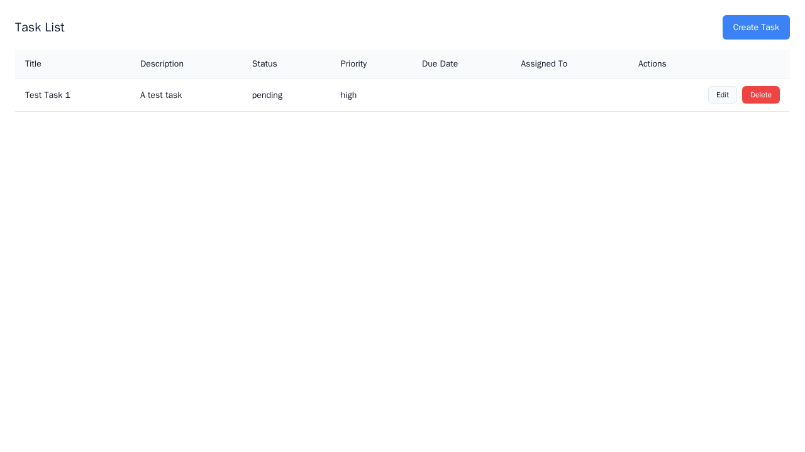
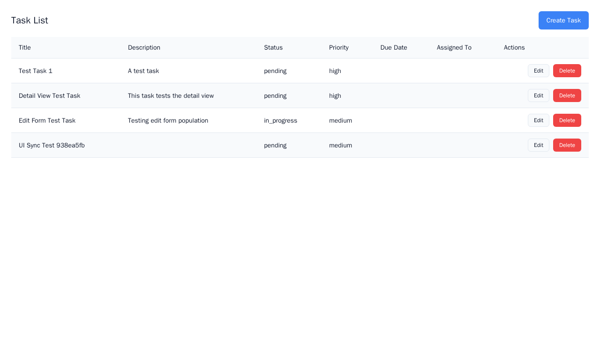

# Simple Task - Generated by Dazzle

> **Automatically generated CRUD application from DSL definition**

This showcase demonstrates how Dazzle transforms a simple DSL specification into
a fully functional, professionally-styled web application.

---

## Overview

| Metric | Value |
|--------|-------|
| **Example** | `simple_task` |
| **Generated** | 2025-11-29 23:07 |
| **UX Coverage** | 96.0% |

---

## DSL Definition

The entire application is defined using Dazzle's declarative DSL:

```dsl
module simple_task.core
app simple_task "Simple Task Manager"
entity Task "Task":
  id: uuid pk
  title: str(200) required
  description: text
  status: enum[todo,in_progress,done]=todo
  priority: enum[low,medium,high]=medium
  due_date: date
  assigned_to: str(100)
  created_at: datetime auto_add
  updated_at: datetime auto_update

surface task_list "Task List":
  uses entity Task
  mode: list

```

From this simple definition, Dazzle generates a complete application with:
- RESTful API endpoints
- Interactive web UI
- Data persistence
- Form validation

---

## Generated UI

### Create Form

Form for creating new items with validation.



### Form Interface

The form interface for data entry.


### Detail View

Individual item detail view with all fields displayed.


### List View

The main list view showing all items with sorting and filtering.


### 15 Api Ui Sync

Screenshot: 15 Api Ui Sync



### 07 Table Headers Visible

Screenshot: 07 Table Headers Visible


### 01 Page Loaded

Screenshot: 01 Page Loaded


### 09 Hash Navigation Works

Screenshot: 09 Hash Navigation Works


### 03 Has Heading

Screenshot: 03 Has Heading


### 16 After Delete

Screenshot: 16 After Delete


### 08 Table Data Loaded

Screenshot: 08 Table Data Loaded


### 02 Page Has Content

Screenshot: 02 Page Has Content


---

## UX Coverage Report


| Category | Coverage |
|----------|----------|

---

## Try It Yourself

```bash
# Clone the Dazzle repository
git clone https://github.com/your-org/dazzle.git
cd dazzle

# Run this example
cd examples/simple_task
dazzle dnr serve

# Open in browser
# UI: http://localhost:3000
# API: http://localhost:8000/docs
```

---

*Generated by [Dazzle](https://github.com/your-org/dazzle) - DSL-first application development*
